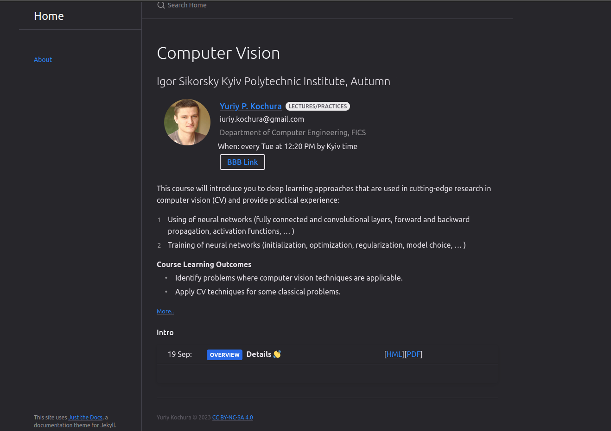
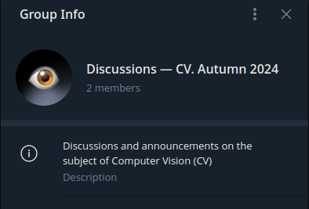

class: middle, center, title-slide 

# Computer Vision

Autumn 2023 

  
Yuriy Kochura 
[iuriy.kochura@gmail.com](mailto:iuriy.kochura@gmail.com)  
<a href="https://t.me/y_kochura">@y_kochura</a>  

---

# Instructor

Lectures and practices :
- .bold[Yuriy P. Kochura] 
  - Department of Computer Engineering, FICS 

 

.center[
.circle.width-40[]
]

---

class: middle

# Course Description

This course will introduce you to deep learning approaches that are used in cutting-edge research in computer vision  and  provide practical experience: 

- Using of neural networks (**fully connected and convolutional layers**, **forward and backward propagation**, **activation functions**, ... )
- Training of neural networks (**initialization**, **optimization**, **regularization**, **model choice**, ... ) 

---

class: middle

# Course Learning Outcomes

1. Identify problems where computer vision techniques are applicable.
1. Apply CV techniques for some classical problems.

---

class: middle

# Prerequisites

1. .bold[Mathematics]: Knowledge of and ability to use calculus, analytical geometry, linear algebra and probability theory.
1. .bold[Programming]: Ability to program in Python.

---

# Classroom

This semester the course takes place online (virtual in-class lectures) on .bold[*BigBlueButton*] at  [https://bbb.comsys.kpi.ua/b/yur-spb-qnl-jqk](https://bbb.comsys.kpi.ua/b/yur-spb-qnl-jqk)

.center.width-90[]

---

class: middle 

# Course hub

All important information about the course will available on the course web page [https://courses-cs-kpi.github.io/cv-23fall/](https://courses-cs-kpi.github.io/cv-23fall/)

- Slides and materials
- Homeworks

.center.width-75[]

---

class: middle

# Textbooks

 There is no required textbook for this class, but I would like to recommend some books for a more comprehensive introduction with advanced topics in deep learning and computer vision or get another perspective on the lecture material:

.grid[
.kol-1-3[
[.center.width-80[]](https://www.deeplearningbook.org/)
.center[Free]
]

.kol-1-3[
[.center.width-95[]](http://neuralnetworksanddeeplearning.com/index.html)
.center[Free]
]

.kol-1-3[
[.center.width-80[]](https://www.manning.com/books/deep-learning-with-python-second-edition?query=deep/)
.center[Freely previewing]
  ]
]

---

class: middle

# Announcements & Discussions

.smaller-x[All *announcements* and *discussions* will take place in Telegram (let me know if you need to be added)

- Discuss materials and ask your questions offline in the group.
- Don't be shy!
]

.grid[
.kol-1-2[
.center.width-100[]
.center.smaller-x[Announcement]
]

.kol-1-2[
.center.width-70[]
.center.smaller-x[Discussions]
]
]

---

class: middle

## Assignments

Exercises to get you started with deep learning techniques for computer vision tasks.

---

class: middle

# Grading

- 60%  &nbsp;&emsp; Programming assignments (15% each)
- 40%  &nbsp;&emsp; Graded test

**Note!**  The requisition of admission to semester control (Graded test) is 
$$\boxed{\text{Programming assignments} \geq 36\%}$$

---

class: end-slide, center
count: false

.larger-xx[Let's start!]

