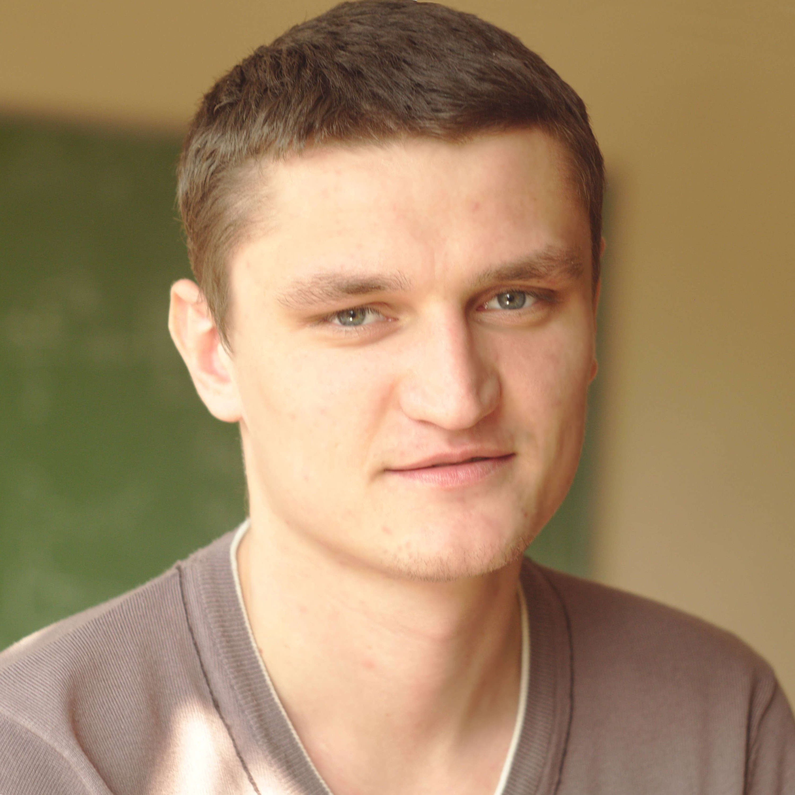
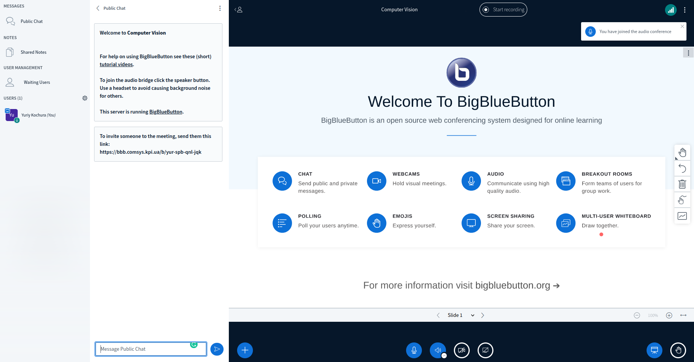

class: middle, center, title-slide 

# Computer Vision

Autumn 2022

  
Yuriy Kochura 
[iuriy.kochura@gmail.com](mailto:iuriy.kochura@gmail.com)  
<a href="https://t.me/y_kochura">@y_kochura</a>  

---

# Instructor

Lectures and practices :
- Yuriy Kochura 
  - Department of Computer Engineering, FICS 

 

.center[
.circle.width-40[]
]

---

class: middle

# Course Description

This course will introduce you to deep learning approaches that are used in cutting-edge research in computer vision  and  provide practical experience: 

- Using of neural networks (**fully connected and convolutional layers**, **forward and backward propagation**, **activation functions**, ... )
- Training of neural networks (**initialization**, **optimization**, **regularization**, **model choice**, ... ) 

---

# Classroom

This quarter (Autumn 2021), the course takes place online (virtual in-class lectures) on .bold[*BigBlueButton*] at  [https://bbb.comsys.kpi.ua/b/yur-spb-qnl-jqk](https://bbb.comsys.kpi.ua/b/yur-spb-qnl-jqk)

.center.width-90[]

---

class: middle 

# Schedule & Slides

The schedule and slides are available at [https://github.com/YKochura/cv-kpi](https://github.com/YKochura/cv-kpi)

Lecture materials:

- In HTML and in PDFs
- Posted/updated online the day before the lesson (**hopefully**)

.center.width-80[]

---

class: middle

# Textbook

 There is no required textbook for this class, but I would like to recommend some books for a more comprehensive introduction with advanced topics in deep learning and computer vision or get another perspective on the lecture material:

.grid[
.kol-1-3[
[.center.width-80[]](https://www.deeplearningbook.org/)
.center[Free]
]

.kol-1-3[
[.center.width-95[]](http://neuralnetworksanddeeplearning.com/index.html)
.center[Free]
]

.kol-1-3[
[.center.width-80[]](https://www.manning.com/books/deep-learning-with-python-second-edition?query=deep/)
.center[Freely previewing]
  ]
]

---

class: middle

# Discussion

All course announcements will take place on Telegram (see invitation link in emails)

- Ask your questions offline in the group.
- Don't be shy!

.center.width-70[]

---

class: middle

## Assignments

Exercises to get you started with deep learning techniques for computer vision tasks.

---

class: middle

## Project

Project of your choosing. Details to be announced soon. 

---

class: middle

# Grading

- 30%  &nbsp;&emsp; Programming assignments (5% each)
- 40%  &nbsp;&emsp; Project
- 30%  &nbsp;&emsp; Final exam

**Note!** Requisition of admission to semester control (final exam): 
$$\boxed{\text{Programming assignments} + \text{Project} \geq 42\%}$$

---

class: end-slide, center
count: false

.larger-xx[Let's start!]