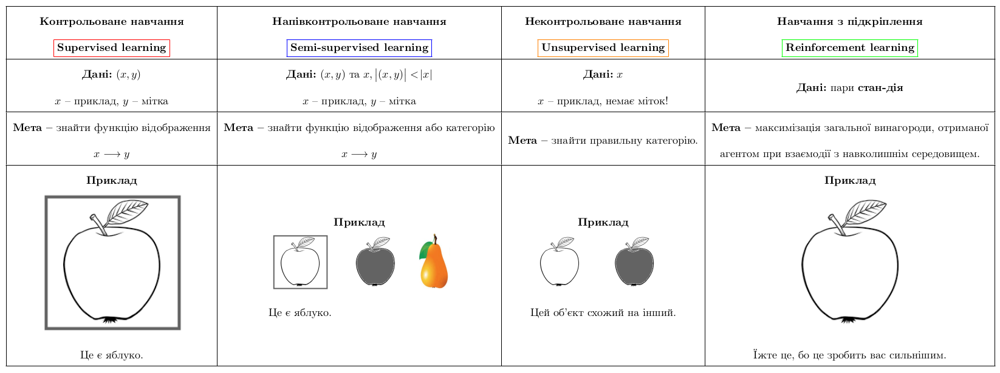

class: middle, center, title-slide

# Computer Vision

Lecture 1: Introduction to Artificial Intelligence (AI)

  
Yuriy Kochura 
[iuriy.kochura@gmail.com](mailto:iuriy.kochura@gmail.com)  
<a href="https://t.me/y_kochura">@y_kochura</a>  

---

class: middle

# Today

- Intelligence vs Artificial Intelligence
- A brief history of AI
- Machine learning definitions and paradigm
- Types of Machine Learning
- Deep Learning conсept
- Applications of Deep Learning
- Perceptron: Forward propagation
- Common activation functions

---

class: blue-slide, middle, center
count: false

.larger-xx[What is Computer Vision?]

---

class: middle

**Computer vision** is an interdisciplinary scientific field that deals with how computers can gain high-level understanding from digital images or videos. From the perspective of engineering, it seeks to understand and automate tasks that the human visual system can do. [[Wikipedia](https://en.wikipedia.org/wiki/Computer_vision)]

Computer Vision іs used in image understanding, search, apps, mapping, medicine, drones, and self-driving cars.  Core visual recognition tasks to many of these applications are image classification, localization and object detection. Recent success of neural networks (aka “deep learning”) have greatly advanced the performance of these state-of-the-art visual recognition systems. 

---

class: blue-slide, middle, center
count: false

.larger-xx[Artificial Intelligence]

---

class: middle

# Can machines think?
.grid[
.kol-2-3[
.width-90[]

.pull-right[&mdash; Alan Turing, 1950]
]

.kol-1-3[.center.circle.width-70[]

.center.smaller-xxx[Image source: [biography](https://www.biography.com/scientist/alan-turing)]
  ]
]

.footnote[Credits: [Alan Turing](https://academic.oup.com/mind/article/LIX/236/433/986238), 1950.]

---

class: middle
count: false

.smaller-x.italic[
In the process of trying to imitate an adult human mind we are bound to think a good deal about
the process which has brought it to the state that it is in. We may notice three components,

  a. The initial state of the mind, say at birth,

  b. The education to which it has been subjected,

  c. Other experience, not to be described as education, to which it has been subjected.

Instead of trying to produce a programme to simulate the adult mind, why not rather try to produce
one which simulates the child’s? If this were then subjected to an appropriate course of education one
would obtain the adult brain. Presumably the child-brain is something like a note-book as one buys
it from the stationers. Rather little mechanism, and lots of blank sheets. (Mechanism and writing
are from our point of view almost synonymous.) Our hope is that there is so little mechanism in
the child-brain that something like it can be easily programmed.

]

.pull-right[&mdash; Alan Turing, 1950]

.footnote[Credits: [Alan Turing](https://academic.oup.com/mind/article/LIX/236/433/986238), 1950.]

---

class: middle

# What is intelligence?

- Intelligence is about

.bold.center.larger-x[To be able to learn to make decisions to achieve goals]
   

- Learning, decisions, and goals are all central

---

class: middle

# What is artificial intelligence?

- In a general sense 

.bold.larger-x[Any technique that enable computers to mimic human behavior]
   
---

class: middle

# What is artificial intelligence?

- In a narrow sense 

.bold.larger-x[Capability of an engineered system to acquire, process and apply knowledge and skills]

- Knowledge are facts, information and skills acquired through experience or education.

.footnote[Credits: [ISO/IEC TR 24028:2020(en)](https://www.iso.org/obp/ui/#iso:std:iso-iec:tr:24028:ed-1:v1:en:term:3.4), 2020.]

---

class: middle

## A brief history of AI

.smaller-xx[
- 1940—1952: Early days
  - 1943: McCulloch & Pitts: Boolean circuit model of brain
  - 1950: Turing's ''Computing Machinery and Intelligence''

- 1952–1956:  The birth of AI
  - 1950s: Early AI programs, including Samuel's checkers program,
Newell & Simon's Logic Theorist, Gelernter's Geometry Engine
  - 1956: Dartmouth meeting: ''Artificial Intelligence'' adopted

- 1956–1974: The golden years 
  - 1958: Frank Rosenblatt invented [perceptron](https://en.wikipedia.org/wiki/Perceptron) (simple neural network)
  - 1964: [Bobrow's program](https://en.wikipedia.org/wiki/STUDENT_(computer_program) that solves algebra word problems
  - 1965: Robinson's complete algorithm for logical reasoning

- 1974–1980: The first AI winter

- 1980–1987: Expert systems industry boom
- 1987—1993: Expert systems industry busts: the second AI winter 

- 1993–2011: Statistical approaches 
  - Resurgence of probability, focus on uncertainty
  - General increase in technical depth
  - Intelligent agents

- 2011–present: Deep Learning, Big Data and AI
  - Big data, big compute, neural networks
  - AI used in many industries
]

.footnote[Credits: [Wikipedia - History of artificial intelligence](https://en.wikipedia.org/wiki/History_of_artificial_intelligence#Deep_learning)]

---

class: middle

# AI is a rich field

.center.width-90[]

.footnote[Image Source: [Marizel B. and Ma. Louella Salenga](https://www.researchgate.net/publication/324183626_Bitter_Melon_Crop_Yield_Prediction_using_Machine_Learning_Algorithm), 2018.]

---

class: middle

.center.width-90[]

.footnote[Image Source: [Why you Might Want to use Machine Learning](https://ml-ops.org/content/motivation).]

---

class: middle

.center.width-50[]

"Just as electricity transformed almost everything 100 years ago, today I actually have a hard time thinking of an industry that I don't think AI will transform in the next several years."

.pull-right[&mdash; Andrew Ng]

.footnote[Credits: [Andrew Ng: Artificial Intelligence is the New Electricity](https://www.youtube.com/watch?v=21EiKfQYZXc), 2017.]

---

class: blue-slide, middle, center
count: false

.larger-xx[Machine Learning]

---

class: middle

# What is machine learning?

.grid[
.kol-2-3[
.width-90[]

Field of study that gives computers the ability to learn without being explicitly programmed.
.pull-right[&mdash; Arthur Samuel, 1959]
]

.kol-1-3[.center.circle.width-60[]

.center.smaller-xxx[Image source: [wikipedia](https://en.wikipedia.org/wiki/Arthur_Samuel#/media/File:This_is_the_photo_of_Arthur_Samuel.jpg)]
  ]
]

.footnote[Credits: [Arthur Samuel](http://users.auth.gr/kehagiat/Research/GameTheory/12CombBiblio/Checkers_Samuels_ibmrd1106C.pdf), 1959.]

---

class: middle

# What is machine learning?

.grid[
.kol-2-3[

Machine Learning is the study of computer algorithms that improve automatically through experience.

.pull-right[&mdash; Tom Mitchell, 1997]
]

.kol-1-3[.center.width-100[]

.center.smaller-xxx[Image source: [Tom Mitchell's Home Page](http://www.cs.cmu.edu/~tom/)]
  ]
]

.footnote[Credits: [Tom Mitchell](http://www.cs.cmu.edu/~tom/mlbook.html), 1997.]

---

class: middle

# Machine learning: a new programming paradigm

.center.width-90[]

---

class: middle

# Types of Machine Learning

.center[
.width-100[]
]

---

class: middle

# What is Deep Learning?

.center.width-90[]

.footnote[Slide source: [MIT 6.S191](http://introtodeeplearning.com/)]

---

class: middle

# Why Deep Learning?

Hand engineered features are time consuming, brittle, and not scalable in practice

Can we learn the **underlying features** directly from data?

.center.width-90[]

.footnote[Slide source: [MIT 6.S191](http://introtodeeplearning.com/)]

---

# Why does DL work now?

.grid[
.kol-1-2[
Algorithms (old and new)  
.width-90[]
]
.kol-1-2[
More data
.smaller-xx[
- Larger Datasets
- Easier Collection & Storage
]

.center.width-50[]
]
]

.center.grid[
.kol-1-2[
Software (New models and improved techniques) 
.width-90[]
]
.kol-1-2[
Faster compute engines  
.width-50[]
]
]

???

The success of deep learning is multi-factorial...

---

class: middle

## DL as an architectural language

.width-100[]

.footnote[Image source: [http://chelseamarzean.com/post-the-atomic-workflow/](http://chelseamarzean.com/post-the-atomic-workflow/), 2016.]

---

class: middle

.center.circle.width-30[]

.center.smaller-xxx[Image source: [Christopher Bishop](https://www.microsoft.com/en-us/research/people/cmbishop/)]

.italic[For the last forty years we have programmed computers; for the next forty years we will train them.]

.pull-right[&mdash; Chris Bishop, 2020.]

.footnote[Credits: [Chris Bishop on "The Real AI Revolution" NeurIPS 2020](https://www.ml6.eu/knowhow/ml6-at-neurips-2020)]

---

class: middle 

.center.width-70[]

.italic["ACM named .bold[Yann LeCun], .bold[Geoffrey Hinton], and .bold[Yoshua Bengio] recipients of the .bold[2018 ACM A.M. Turing Award] for conceptual and engineering breakthroughs that have made deep neural networks a critical component of computing."]

.footnote[Credits: [Wikipedia](https://en.wikipedia.org/wiki/Turing_Award)]

---

class: blue-slide, middle, center
count: false

.larger-xx[Applications and successes]

---

class: middle, center, black-slide

<iframe width="600" height="450" src="https://www.youtube.com/embed/5kpsZoKjPgQ" frameborder="0" allowfullscreen></iframe>

Object detection, pose estimation, segmentation (2019)

---

class: middle, center, black-slide

<iframe width="600" height="450" src="https://www.youtube.com/embed/V1eYniJ0Rnk" frameborder="0" allowfullscreen></iframe>

Reinforcement learning (Mnih et al, 2014)

---

class: middle, center, black-slide

<iframe width="600" height="450" src="https://www.youtube.com/embed/HcZ48JDamyk" frameborder="0" allowfullscreen></iframe>

Strategy games (Deepmind, 2016-2018)

---

class: middle, center, black-slide

<iframe width="600" height="450" src="https://www.youtube.com/embed/qhUvQiKec2U" frameborder="0" allowfullscreen></iframe>

Autonomous cars (NVIDIA, 2016)

---

class: middle, center, black-slide

<iframe width="600" height="450" src="https://www.youtube.com/embed/tlThdr3O5Qo" frameborder="0" allowfullscreen></iframe>

Autopilot (Tesla, 2019)

???

A full build of Autopilot neural networks involves 48 networks that take 70,000 GPU hours to train 🔥. Together, they output 1,000 distinct tensors (predictions) at each timestep.

---

class: middle, black-slide

.center[
<video loop controls preload="auto" height="400" width="600">
  <source src="./figures/lec1/physics-simulation.mp4" type="video/mp4">
</video>

Physics simulation (Sanchez-Gonzalez et al, 2020)

]

---

class: middle, black-slide, center

<iframe width="600" height="450" src="https://www.youtube.com/embed/gg7WjuFs8F4" frameborder="0" allowfullscreen></iframe>

AI for Science (Deepmind, AlphaFold, 2020)

---

class: middle, center, black-slide

<iframe width="600" height="450" src="https://www.youtube.com/embed/7gh6_U7Nfjs" frameborder="0" allowfullscreen></iframe>

Speech synthesis and question answering (Google, 2018)

---

class: middle, center, black-slide

<iframe width="600" height="450" src="https://www.youtube.com/embed/Khuj4ASldmU" frameborder="0" allowfullscreen></iframe>

Artistic style transfer (Ruder et al, 2016)

---

class: middle, center, black-slide

<iframe width="600" height="450" src="https://www.youtube.com/embed/kSLJriaOumA" frameborder="0" allowfullscreen></iframe>

Image generation (Karras et al, 2018)

---

class: middle, center, black-slide

<iframe width="600" height="450" src="https://www.youtube.com/embed/egJ0PTKQp4U?start=223" frameborder="0" allowfullscreen></iframe>

Music composition (NVIDIA, 2017)

---

class: middle, center, black-slide

<iframe width="600" height="450" src="https://www.youtube.com/embed/BIDaxl4xqJ4" frameborder="0" allowfullscreen></iframe>

Dali Lives (2019)

---

class: middle, center, black-slide

<iframe width="600" height="450" src="https://www.youtube.com/embed/J_2fIGmsoRg" frameborder="0" allowfullscreen></iframe>

Reface revived the famous Kyiv murals for Kyiv Day (2021)

---

class: blue-slide, middle, center
count: false

.larger-xx[The Preceptron]

The structural building block of deep learning

---

class: middle

# Biological vs Artificial neuron 

.center[
.width-100[]
]

---

class: middle

.center[
.width-100[]
]

.footnote[Slide source: [MIT 6.S191](http://introtodeeplearning.com/)]

---

class: middle

.center[
.width-100[]
]

.footnote[Slide source: [MIT 6.S191](http://introtodeeplearning.com/)]

---

class: middle

.center[
.width-100[]
]

.footnote[Slide source: [MIT 6.S191](http://introtodeeplearning.com/)]

---

class: middle

.center[
.width-100[]
]

.footnote[Slide source: [MIT 6.S191](http://introtodeeplearning.com/)]

---

class: middle

# Common Activation Functions

.center[
.width-100[]
]

---

class: middle

.center[
.width-100[]
]

.footnote[Slide source: [MIT 6.S191](http://introtodeeplearning.com/)]

---

class: middle

.center[
.width-100[]
]

.footnote[Slide source: [MIT 6.S191](http://introtodeeplearning.com/)]

---

class: middle

.center[
.width-100[]
]

.footnote[Slide source: [MIT 6.S191](http://introtodeeplearning.com/)]

---

class: middle

.center[
.width-100[]
]

.footnote[Slide source: [MIT 6.S191](http://introtodeeplearning.com/)]

---

class: middle

.center[
.width-100[]
]

.footnote[Slide source: [MIT 6.S191](http://introtodeeplearning.com/)]

---

class: middle

.center[
.width-100[]
]

.footnote[Slide source: [MIT 6.S191](http://introtodeeplearning.com/)]

---

class: middle

.center[
.width-100[]
]

.footnote[Slide source: [MIT 6.S191](http://introtodeeplearning.com/)]

---

class: middle

.center[
.width-100[]
]

.footnote[Slide source: [MIT 6.S191](http://introtodeeplearning.com/)]

---

class: end-slide, center
count: false

.larger-xx[The end]

