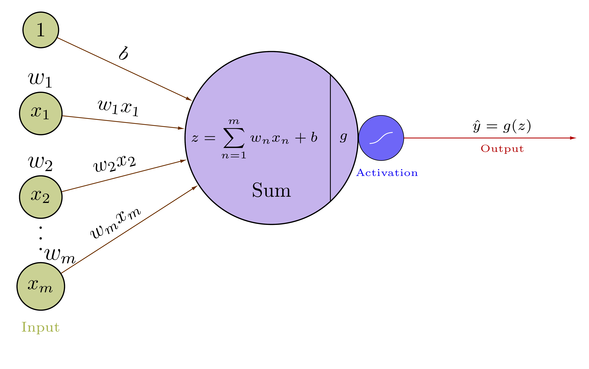
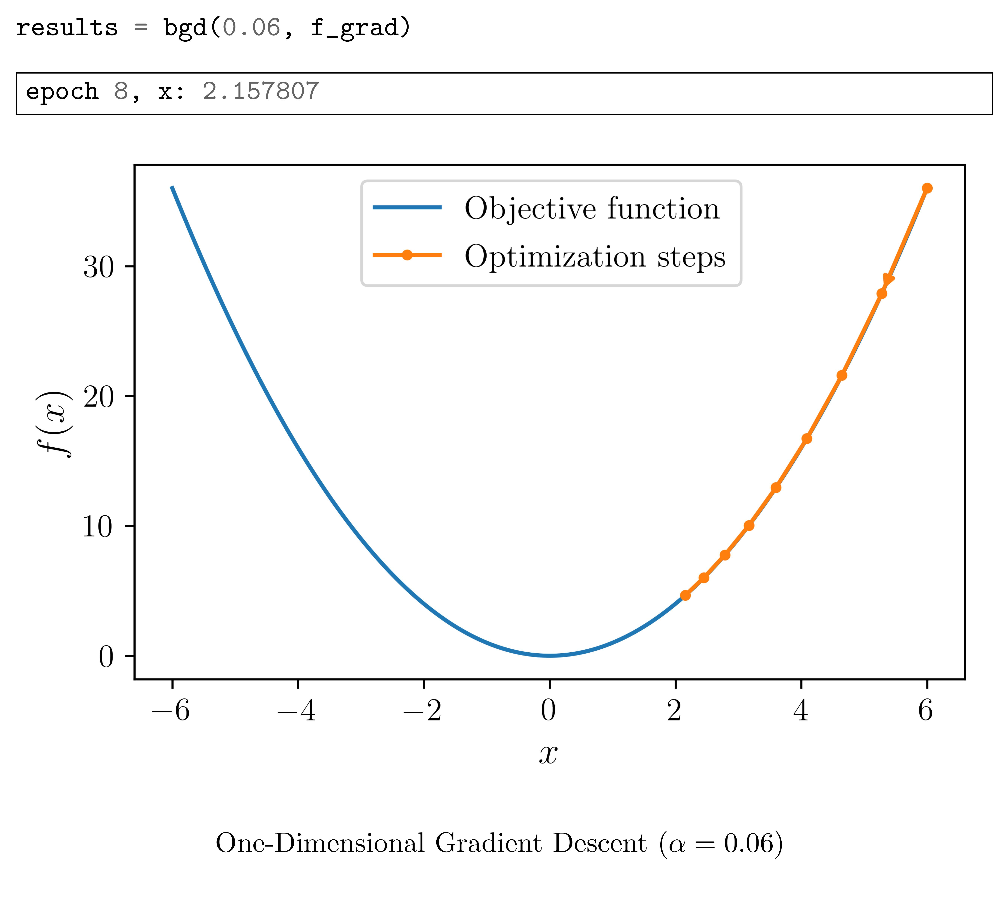
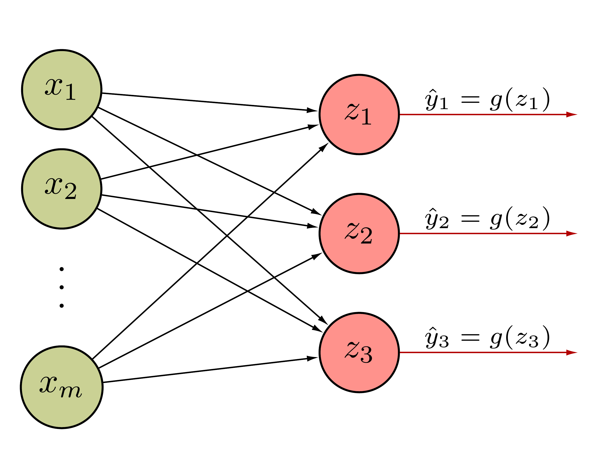
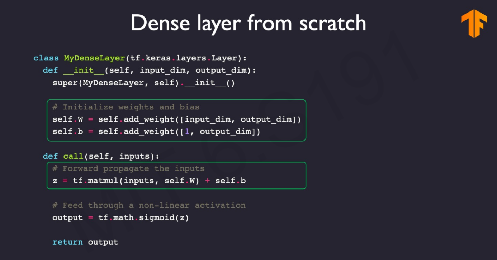
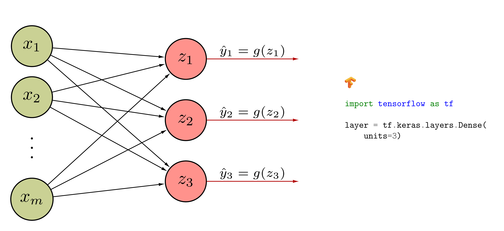
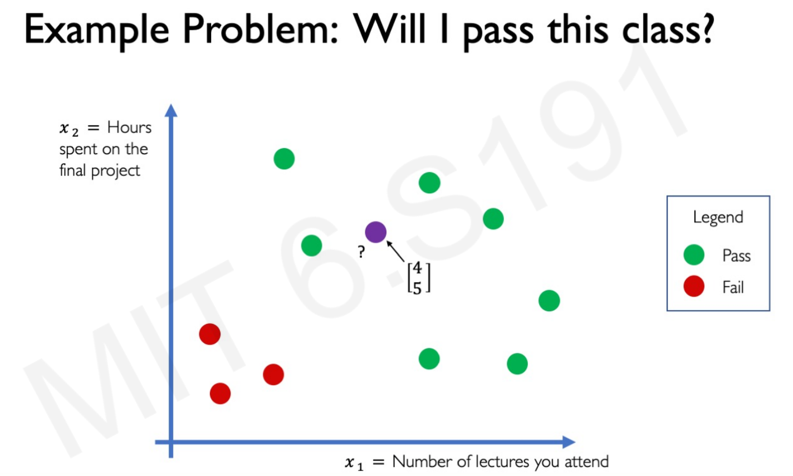
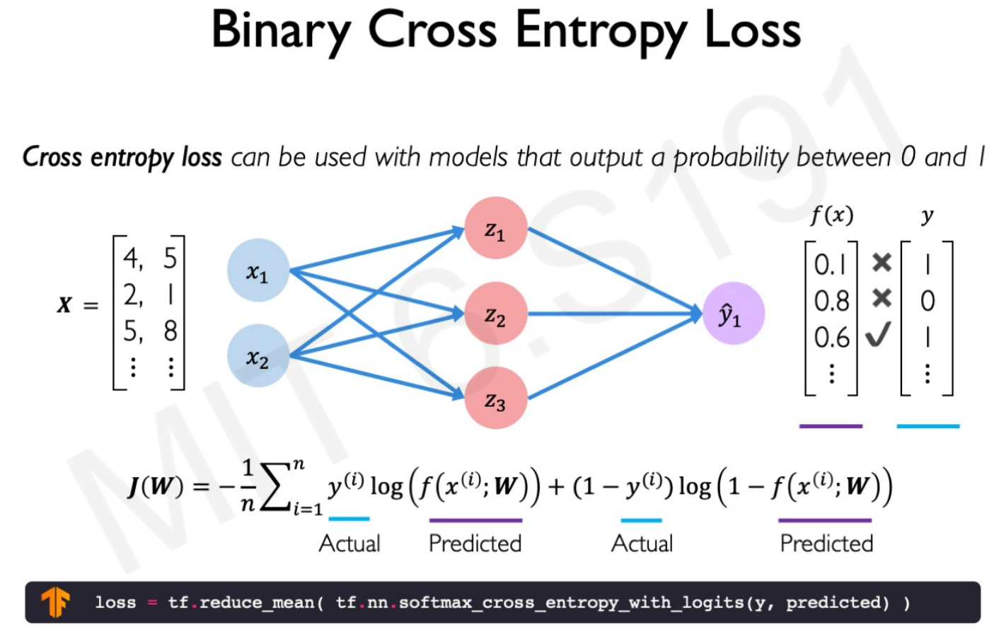

class: middle, center, title-slide

# Computer Vision

Lecture 2: Building Neural Networks with Perceptrons

  
Yuriy Kochura 
[iuriy.kochura@gmail.com](mailto:iuriy.kochura@gmail.com)  
<a href="https://t.me/y_kochura">@y_kochura</a>  

---

class: middle

# Today

- Single-layer Neural Network: Forward propagation
- One-Dimensional Gradient Descent
- Single-layer Neural Network: Backward propagation
- Multi Output Perceptron
- Multilayer Perceptron (feedforward neural network)
- An Example of Applying Neural Networks

---

class: blue-slide, middle, center
count: false

.larger-xx[The Perceptron: Simplified]

Single-layer Neural Network

Logistic Regression

---
# Perceptron

The perceptron (Rosenblatt, 1958)

$$g(z) = \begin{cases}
   1 &\text{if } z =\sum_i w_i x_i + b \geq 0  \\\\
   0 &\text{otherwise}
\end{cases}$$

This model was originally motivated by biology, with $w_i$ being synaptic weights for inputs $x_i$ and $g$ firing rates.
.center.width-65[]

.footnote[Image source: Frank Rosenblatt, [Mark I Perceptron operators' manual](https://apps.dtic.mil/sti/pdfs/AD0236965.pdf), 1960.]

???

In November 1958 Frank Rosenblatt invented the Perceptron, or Mark I, at Cornell University. Completed in 1960, this was the first computer that could learn new skills by trial and error, using a type of neural network that simulated human thought processes.

---

class: middle

.center[
.width-70[]
]

.smaller-xx[
$$
\begin{aligned}
\mathbf{X} = \begin{bmatrix}
x\_1  \\\\
x\_2  \\\\
\vdots \\\\
x\_m
\end{bmatrix} 
&&
\mathbf{W} = \begin{bmatrix}
w\_1  \\\\
w\_2  \\\\
\vdots \\\\
w\_m
\end{bmatrix}
&& 
\mathbf{X}^T = \begin{bmatrix}
x\_1 & x\_2 & \cdots & x\_m
\end{bmatrix} 
\end{aligned}$$

$$\boxed{\begin{aligned}z &= \sum\_{n=1}^{m} w\_n x\_n + b = \mathbf{X}^T \cdot \mathbf{W} + b = \mathbf{W}^T \cdot \mathbf{X} + b \\\\
\hat y &= g(z) \\\\
\mathcal{L}(\hat y, y) &= - \frac{1}{n} \sum\_{i=1}^{n} \big(y^{(i)} \log(\hat y^{(i)}) + (1- y^{(i)}) \log(1 -\hat y^{(i)}) \big)
\end{aligned}}$$

]

---

class: middle

.center[
.width-80[]
]

.smaller-xx[

.center[*Forward propagation*]

$$\boxed{\begin{aligned}z &= \sum\_{n=1}^{m} w\_n x\_n + b = \mathbf{X}^T \cdot \mathbf{W} + b = \mathbf{W}^T \cdot \mathbf{X} + b \\\\
\hat y &= g(z) \\\\
\mathcal{L}(\hat y, y) &= - \frac{1}{n} \sum\_{i=1}^{n} \big(y^{(i)} \log(\hat y^{(i)}) + (1- y^{(i)}) \log(1 -\hat y^{(i)}) \big)
\end{aligned}}$$

]

---

class: middle

## Example

Suppose $m = 3$

$$
\begin{aligned}
\mathbf{X} = \begin{bmatrix}
x\_1  \\\\
x\_2  \\\\
x\_3
\end{bmatrix} = \begin{bmatrix}
-0.1  \\\\
0.7  \\\\
0.5
\end{bmatrix} 
&&
\mathbf{W} = \begin{bmatrix}
w\_1  \\\\
w\_2  \\\\
w\_3
\end{bmatrix} =
\begin{bmatrix}
1  \\\\
-2  \\\\
2
\end{bmatrix}
&&
b = 0.8
\end{aligned}$$

$$\boxed{\begin{aligned}
z = \sum_{n=1}^{3} w_n x_n + b &= w_1 x_1 + w_2 x_2 + w_3 x_3 + b = \\\\
&= 1 \cdot -0.1 + -2 \cdot 0.7 + 2 \cdot 0.5 + 0.8 = 0.3
\end{aligned}}$$

$$\boxed{\begin{aligned}
z = \mathbf{X}^T \cdot \mathbf{W} + b &= \begin{bmatrix}
x\_1 & x\_2 &  x\_3 
\end{bmatrix} \begin{bmatrix}
w\_1  \\\\
w\_2  \\\\
w\_3
\end{bmatrix} + b = \\\\
&= w_1 x_1 + w_2 x_2 + w_3 x_3 + b = 0.3
\end{aligned}}$$

$$\hat y  = g(z) = g(\mathbf{X}^T \cdot \mathbf{W} + b) = \frac{1}{1 + \exp(-z)} = \frac{1}{1 + \exp(-0.3)} \approx 0.57 $$

---

class: blue-slide, middle, center
count: false

.larger-xx[One-Dimensional Gradient Descent]

---

class: middle

## One-Dimensional Gradient Descent
.smaller-x[

Consider some continuously differentiable real-valued function $f: \mathbb{R} \rightarrow \mathbb{R}$. Using a Taylor expansion we obtain:

$$f(x + \varepsilon) = f(x) + \varepsilon f^{'}(x) + \mathcal{O}(\varepsilon^2)$$

To keep things simple let's pick a fixed step size $\alpha > 0$ and choose $\varepsilon = -\alpha f^{'}(x)$. Plugging this into the Taylor expansion above we get:

$$f(x -\alpha f^{'}(x)) = f(x) - \alpha f^{'2}(x)  + \mathcal{O}(\alpha^2 f^{'2}(x))$$

If the derivative $f^{'}(x) \neq 0$ does not vanish we make progress since $\alpha f^{'2}(x) > 0$. Moreover, we can always choose $\alpha$ small enough for the higher-order terms to become irrelevant. Hence we arrive at

$$f(x -\alpha f^{'}(x)) \lessapprox f(x)$$

This means that, if we use

$$x \leftarrow x -\alpha f^{'}(x)$$

to iterate $x$, the value of function $f(x)$  might decline. 
]

???
Gradient descent in one dimension is an excellent example to explain why the gradient descent algorithm may reduce the value of the objective function.

The Taylor series is used to describe what the function looks like in the neighborhood of some poin $x$.

That is, in first-order approximation $f(x + \varepsilon)$  is given by the function value $f(x)$ and the first derivative $f^{'}(x)$ at $x$. It is not unreasonable to assume that for small $\varepsilon$ moving in the direction of the negative gradient will decrease $f$. 

Therefore, in gradient descent we first choose an initial value $x$ and a constant $\alpha > 0$ and then use them to continuously iterate $x$ until the stop condition is reached, for example, when the magnitude of the gradient $|f^{'}(x)|$ is small enough or the number of iterations has reached a certain value.

---

class: middle

.center[
.width-80[]
]

???

For simplicity we choose the objective function $f(x) = x^2$ to illustrate how to implement gradient descent. Although we know that $x = 0$ is the solution to minimize $f(x)$, we still use this simple function to observe how $x$ changes.

---

class: middle

The progress of optimizing over $x$ 

.center[
.width-80[]
]

---

class: middle

The progress of optimizing over $x$ 

.center[
.width-80[]
]

???
If we use a learning rate that is too small, it will cause $x$ to update very slowly, requiring more iterations to get a better solution.

---

lass: middle

The progress of optimizing over $x$ 

.center[
.width-80[]
]

???
if we use an excessively high learning rate, $|\alpha f^{'}(x)|$ might be too large for the first-order Taylor expansion formula. That is, the term $\mathcal{O}(\alpha^2 f^{'2}(x))$ might become significant. In this case, we cannot guarantee that the iteration of $x$ will be able to lower the value of $f(x)$.

---

class: blue-slide, middle, center
count: false

.larger-xx[The Perceptron: Backward propagation]

---

class: middle

In Leibniz notations, the **chain rule** states that
$$
\begin{aligned}
\frac{\partial \ell}{\partial \theta\_i} &= \sum\_{k \in \text{parents}(\ell)} \frac{\partial \ell}{\partial u\_k} \underbrace{\frac{\partial u\_k}{\partial \theta\_i}}\_{\text{recursive case}}
\end{aligned}$$

---

class: middle

## Backpropagation

- Since a neural network is a **composition of differentiable functions**, the total
derivatives of the loss can be evaluated backward, by applying the chain rule
recursively over its computational graph.
- The implementation of this procedure is called reverse *automatic differentiation* or **backpropagation**.

---

class: middle

.smaller-xx[

.center[*Forward propagation*]

$$\boxed{\begin{aligned}z &= \sum\_{n=1}^{m} w\_n x\_n + b = \mathbf{X}^T \cdot \mathbf{W} + b = \mathbf{W}^T \cdot \mathbf{X} + b \\\\
\hat y &= g(z) = \sigma(z) = \frac{1}{1 + \exp(-z)} \\\\
\mathcal{L}(\hat y, y) &= - \frac{1}{n} \sum\_{i=1}^{n} \big(y^{(i)} \log(\hat y^{(i)}) + (1- y^{(i)}) \log(1 -\hat y^{(i)}) \big)
\end{aligned}}$$

.grid[
.kol-2-3[

.center[*Backward propagation*]

$$\boxed{\begin{aligned}
\frac{\partial \mathcal{L}(\hat y, y)}{\partial \hat y} &= -\frac{y}{\hat y} + \frac{1- y}{1 - \hat y} \\\\[18pt]
\frac{\partial \mathcal{L}(\hat y, y)}{\partial z} &= \frac{\partial \mathcal{L}(\hat y, y)}{\partial \hat y} \frac{\partial \hat y}{\partial z} = \hat y - y \\\\[18pt]
\frac{\partial \mathcal{L}(\hat y, y)}{\partial \mathbf{W}} &= \frac{\partial \mathcal{L}(\hat y, y)}{\partial \hat y} \frac{\partial \hat y}{\partial z} \frac{\partial z}{\partial \mathbf{W}} = \mathbf{X}^T \cdot (\hat y - y) \\\\[18pt]
\frac{\partial \mathcal{L}(\hat y, y)}{\partial b} &=  \frac{\partial \mathcal{L}(\hat y, y)}{\partial \hat y} \frac{\partial \hat y}{\partial z} \frac{\partial z}{\partial b} = \hat y - y
\end{aligned}}$$
]

.kol-1-3[
.center[*Update the weights and bias*]

$$\boxed{\begin{aligned}
\mathbf{W} &= \mathbf{W} - \alpha \frac{\partial \mathcal{L}(\hat y, y)}{\partial \mathbf{W}} \\\\[18pt]
b &= b - \alpha \frac{\partial \mathcal{L}(\hat y, y)}{\partial b}
\end{aligned}}$$
]]
]

---

class: blue-slide, middle, center
count: false

.larger-xx[Multi Output Perceptron]

---

class: middle

# Multi Output Perceptron

.smaller-x[Because all inputs are densely connected to all outputs, these layers are called *Dense* layers]

.center[
.width-70[]
]

$$z\_j = \sum\_{n=1}^{m} w\_{j, n} x\_n  + b\_j$$

---

class: middle

## Example

.center[
.width-50[]
]
.smaller-xx[
$$\begin{aligned}
\mathbf{X}^{m \times 1} = \begin{bmatrix}
x\_1  \\\\
x\_2  \\\\
\vdots \\\\
x\_m
\end{bmatrix} 
&&
\mathbf{W}^{3 \times m} = \begin{bmatrix}
w\_{11} & w\_{12} &  \cdots & w\_{1m} \\\\
w\_{21} & w\_{22} & \cdots & w\_{2m} \\\\
w\_{31} & w\_{32} & \cdots & w\_{3m}
\end{bmatrix}
&& 
\mathbf{b}^{3 \times 1} = \begin{bmatrix}
b\_1 \\\\
b\_2 \\\\
b\_3
\end{bmatrix}
\end{aligned}$$

$$\boxed{\begin{aligned}
\mathbf{z} =  \mathbf{W} \cdot \mathbf{X} + \mathbf{b} 
&= \begin{bmatrix}
w\_{11} & w\_{12} &  \cdots & w\_{1m} \\\\
w\_{21} & w\_{22} & \cdots & w\_{2m} \\\\
w\_{31} & w\_{32} & \cdots & w\_{3m}
\end{bmatrix} \cdot
\begin{bmatrix}
x\_1  \\\\
x\_2  \\\\
\vdots \\\\
x\_m
\end{bmatrix} + 
\begin{bmatrix}
b\_1 \\\\
b\_2 \\\\
b\_3
\end{bmatrix} = \\\\
&= 
\begin{bmatrix}
w\_{11} x\_1 + w\_{12} x\_2 +  \cdots + w\_{1m} x\_m + b\_1 \\\\
w\_{21} x\_1 + w\_{22} x\_2 +  \cdots + w\_{2m} x\_m + b\_2 \\\\
w\_{31} x\_1 + w\_{32} x\_2 +  \cdots + w\_{3m} x\_m + b\_3 
\end{bmatrix} = \begin{bmatrix}
z\_1 \\\\
z\_2 \\\\
z\_3
\end{bmatrix}
\end{aligned}}$$

]

---

class: middle

.center[
.width-100[]
]

.footnote[Slide source: [MIT 6.S191](http://introtodeeplearning.com/)]

---

class: middle

.smaller-x[Because all inputs are densely connected to all outputs, these layers are called *Dense* layers]

.center[
.width-100[]
]

$$z\_j = \sum\_{n=1}^{m} w\_{j, n} x\_n  + b\_j$$

---

class: blue-slide, middle, center
count: false

.larger-xx[Multilayer Perceptron]

---

class: middle

# One hidden layer Neural Network

.center[
.width-100[]
]

---

class: middle

# One hidden layer Neural Network

.center[
.width-100[]
]

---

class: middle

## One hidden layer Neural Network

.center[
.width-60[]
]

.smaller-xx[
$$\begin{aligned}
\mathbf{X} = \begin{bmatrix}
x\_1  \\\\
x\_2  \\\\
x\_3
\end{bmatrix} 
&&
\mathbf{W}^{[1]} = \begin{bmatrix}
w\_{11} & w\_{12} &  w\_{13} \\\\
w\_{21} & w\_{22} &  w\_{23} \\\\
w\_{31} & w\_{32} &  w\_{33} \\\\
w\_{41} & w\_{42} &  w\_{43}
\end{bmatrix}
&& 
\mathbf{b}^{[1]} = \begin{bmatrix}
b\_1 \\\\
b\_2 \\\\
b\_3 \\\\
b\_4
\end{bmatrix}
&&
\mathbf{W}^{[2]} = \begin{bmatrix}
w\_{1} & w\_{2} &  w\_{3} & w\_{4} 
\end{bmatrix}
&& 
b^{[2]} = b
\end{aligned}$$

$$\boxed{\begin{aligned}
\mathbf{z}^{[1]} &= \mathbf{W}^{[1]} \cdot \mathbf{X} + \mathbf{b}^{[1]} \\\\
\mathbf{a}^{[1]} &= g^{[1]}(\mathbf{z}^{[1]}) \\\\
z^{[2]} &= \mathbf{W}^{[2]} \cdot \mathbf{a}^{[1]} + b^{[2]} \\\\
\hat y &= a^{[2]} = g^{[2]}(z^{[2]})
\end{aligned}}$$
]

---

class: middle

# Deep Neural Network

.center[
.width-100[]
]

---

class: blue-slide, middle, center
count: false

.larger-xx[Applying Neural Networks]

---

class: middle

.center[
.width-100[]
]

.footnote[Slide source: [MIT 6.S191](http://introtodeeplearning.com/)]

---

class: middle

.center[
.width-100[]
]

.footnote[Slide source: [MIT 6.S191](http://introtodeeplearning.com/)]

---

class: middle

.center[
.width-100[]
]

.footnote[Slide source: [MIT 6.S191](http://introtodeeplearning.com/)]

---

class: middle

.center[
.width-100[]
]

.footnote[Slide source: [MIT 6.S191](http://introtodeeplearning.com/)]

---

class: middle

.center[
.width-100[]
]

.footnote[Slide source: [MIT 6.S191](http://introtodeeplearning.com/)]

---

class: middle

.center[
.width-100[]
]

.footnote[Slide source: [MIT 6.S191](http://introtodeeplearning.com/)]

---

class: middle

.center[
.width-100[]
]

.footnote[Slide source: [MIT 6.S191](http://introtodeeplearning.com/)]

---

class: middle

.center[
.width-100[]
]

.footnote[Slide source: [MIT 6.S191](http://introtodeeplearning.com/)]

---

class: middle

.center[
.width-100[]
]

.footnote[Slide source: [MIT 6.S191](http://introtodeeplearning.com/)]

---

class: end-slide, center
count: false

.larger-xx[The end]

