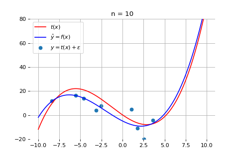

class: middle, center, title-slide

# Computer Vision

Lecture 3: Statistical learning

  
Yuriy Kochura 
[iuriy.kochura@gmail.com](mailto:iuriy.kochura@gmail.com)  
<a href="https://t.me/y_kochura">@y_kochura</a>  

---

# Today

A recap on statistical learning:
- Supervised learning
- Empirical risk minimization
- Under-fitting and over-fitting
- Bias-variance dilemma

---

class: blue-slide, middle, center
count: false

.larger-xx[Statistical learning]

Based on Prof. Gilles Louppe lecture

---

class: middle

# Model

.center.width-50[]

.footnote[Credits: NVIDIA]

???
While what is inside of a deep neural network may be complex, at their core, they are
simply functions. They take some input and generate some output. For example, an ML model for computer vision might be able to identify cars and pedestrians in a real-time video. Under the hood, a machine learning model is a mathematical representation of objects and their relationships to each other.

---

# Supervised learning

Consider an unknown joint probability distribution $p\_{X,Y}$.

Assume training data
$$(\mathbf{x}\_i,y\_i) \sim p\_{X,Y},$$
with $\mathbf{x}\_i \in \mathcal{X}$, $y\_i \in \mathcal{Y}$, $i=1, ..., n$.

- In most cases,
    - $\mathbf{x}\_i$ is a $m$-dimensional vector of features or descriptors,
    - $y\_i$ is a scalar (e.g., a category or a real value).
- The training data is generated i.i.d.
- The training data can be of any finite size $n$.
- In general, we do not have any prior information about $p\_{X,Y}$.

???

In most cases, x is a vector, but it could be an image, a piece of text or a sample of sound.

i.i.d. -- Independent and identically distributed random variables

---

class: middle

## Inference

Supervised learning is usually concerned with the two following inference problems:
- **Classification**:
Given $(\mathbf{x}\_i, y\_i) \in \mathcal{X}\times\mathcal{Y} = \mathbb{R}^m \times \bigtriangleup^C$, for $i=1, ..., n$,
we want to estimate for any new $\mathbf{x}$, $$\arg \max\_y p(Y=y|X=\mathbf{x}).$$
- **Regression**:
Given $(\mathbf{x}\_i, y\_i) \in \mathcal{X}\times\mathcal{Y} =  \mathbb{R}^m \times \mathbb{R}$, for $i=1, ..., n$,
we want to estimate for any new $\mathbf{x}$, $$\mathbb{E}\left[ Y|X=\mathbf{x} \right].$$

???

$\bigtriangleup^C$ is the simplex $\\{\mathbf{p} \in \mathbb{R}^C_+ : ||\mathbf{p}||_1 = 1\\}$.

---

class: middle, center

Classification consists in identifying 
a decision boundary between objects of distinct classes.

---

class: middle, center

Regression aims at estimating relationships among (usually continuous) variables.

---

class: middle

Or more generally, inference is concerned with the estimation of the conditional 
$$p(Y=y|X=\mathbf{x})$$
for any new $(\mathbf{x},y)$.

---

# Empirical risk minimization

Consider a function $f : \mathcal{X} \to \mathcal{Y}$ produced by some learning algorithm. The predictions
of this function can be evaluated through a loss
$$\mathcal{L} : \mathcal{Y} \times  \mathcal{Y} \to \mathbb{R},$$
such that $\mathcal{L}(y, f(\mathbf{x})) \geq 0$ measures how close the prediction $f(\mathbf{x})$ from $y$ is.

 
## Examples of loss functions

.grid[
.kol-1-3[Classification:]
.kol-2-3[$\mathcal{L}(y,f(\mathbf{x})) = \mathbf{1}\_{y \neq f(\mathbf{x})}$]
]
.grid[
.kol-1-3[Regression:]
.kol-2-3[$\mathcal{L}(y,f(\mathbf{x})) = (y - f(\mathbf{x}))^2$]
]

???
Empirical risk minimization (ERM) is a principle in statistical learning theory which defines a family of learning algorithms and is used to give theoretical bounds on their performance. The core idea is that we cannot know exactly how well an algorithm will work in practice (the true "risk") because we don't know the true distribution of data that the algorithm will work on, but we can instead measure its performance on a known set of training data (the "empirical" risk). 

---

class: middle

Let $\mathcal{F}$ denote the hypothesis space, i.e. the set of all functions $f$ than can be produced by the chosen learning algorithm.

We are looking for a function $f \in \mathcal{F}$ with a small **expected risk** (or generalization error)
$$R(f) = \mathbb{E}\_{(\mathbf{x},y)\sim p\_{X,Y}}\left[ \mathcal{L}(y, f(\mathbf{x})) \right]$$

This means that for a given data generating distribution $p\_{X,Y}$ and for a given hypothesis space $\mathcal{F}$,
the optimal model is
$$f\_\* = \arg \min\_{f \in \mathcal{F}} R(f)$$

---

class: middle

Unfortunately, since $p\_{X,Y}$ is unknown, the expected risk cannot be evaluated and the optimal
model cannot be determined.

However, if we have i.i.d. training data $\mathbf{d} = \\\{(\mathbf{x}\_i, y\_i) | i=1,\ldots,n\\\}$, we can
compute an estimate, the **empirical risk** (or training error)
$$\mathcal{J}(f, \mathbf{d}) = \frac{1}{n} \sum\_{(\mathbf{x}\_i, y\_i) \in \mathbf{d}} \mathcal{L}(y\_i, f(\mathbf{x}\_i))$$

This estimator is *unbiased* and can be used for finding a good enough approximation of $f\_\*$. This results into the **empirical risk minimization principle**:
$$f\_\*^{\mathbf{d}} = \arg \min\_{f \in \mathcal{F}} \mathcal{J}(f, \mathbf{d})$$

???

What does unbiased mean?

=> The expected empirical risk estimate (over d) is the expected risk.

---

class: middle

Most machine learning algorithms, including **neural networks**, implement empirical risk minimization.

Under regularity assumptions, empirical risk minimizers converge:

$$\lim\_{N \to \infty} f\_\*^{\mathbf{d}} = f\_\*$$

???

This is why tuning the parameters of the model to make it work on the training data is a reasonable thing to do.

---

# Polynomial regression

.center[]

Consider the joint probability distribution $p\_{X,Y}$ induced by the data generating
process
$$(x,y) \sim p\_{X,Y} \Leftrightarrow x \sim U[-10;10], \epsilon \sim \mathcal{N}(0, \sigma^2), y = t(x) + \varepsilon$$
where $x \in \mathbb{R}$, $y\in\mathbb{R}$ and $t$ is an unknown polynomial of degree 3.

---

class: middle

Our goal is to find a function $f$ that makes good predictions on average over $p\_{X,Y}$.

Consider the hypothesis space $f \in \mathcal{F}$ of polynomials of degree 3 defined through their parameters $\mathbf{w} \in \mathbb{R}^4$ such that
$$\hat{y} \triangleq f(x; \mathbf{w}) = \sum\_{d=0}^3 w\_d x^d$$  

---

class: middle

For this regression problem, we use the squared error loss
$$\mathcal{L}(y, f(x;\mathbf{w})) = (y - f(x;\mathbf{w}))^2$$
to measure how wrong the predictions are.

Therefore, our goal is to find the best value $\mathbf{w}\_\*$ such that
$$\begin{aligned}
\mathbf{w}\_\* &= \arg\min\_\mathbf{w} R(\mathbf{w}) \\\\
&= \arg\min\_\mathbf{w}  \mathbb{E}\_{(x,y)\sim p\_{X,Y}}\left[ (y-f(x;\mathbf{w}))^2 \right]
\end{aligned}$$

---

class: middle

Given a large enough training set $\mathbf{d} = \\\{(x\_i, y\_i) | i=1,\ldots,n\\\}$, the
empirical risk minimization principle tells us that a good estimate $\mathbf{w}\_\*^{\mathbf{d}}$ of $\mathbf{w}\_\*$ can be found by minimizing the empirical risk:
$$\begin{aligned}
\mathbf{w}\_\*^{\mathbf{d}} &= \arg\min\_\mathbf{w} \mathcal{J}(\mathbf{w},\mathbf{d}) = \\\\
&= \arg\min\_\mathbf{w} \frac{1}{n}  \sum\_{(x\_i, y\_i) \in \mathbf{d}} (y\_i - f(x\_i;\mathbf{w}))^2 = \\\\
&= \arg\min\_\mathbf{w} \frac{1}{n}  \sum\_{(x\_i, y\_i) \in \mathbf{d}} (y\_i - \sum\_{d=0}^3 w\_d x\_i^d)^2 = \\\\
&= \arg\min\_\mathbf{w} \frac{1}{n} \left\lVert
\underbrace{\begin{pmatrix}
y\_1 \\\\
y\_2 \\\\
\ldots \\\\
y\_n
\end{pmatrix}}\_{\mathbf{y}} -
\underbrace{\begin{pmatrix}
x\_1^0 \ldots x\_1^3 \\\\
x\_2^0 \ldots x\_2^3 \\\\
\ldots \\\\
x\_n^0 \ldots x\_n^3
\end{pmatrix}}\_{\mathbf{X}}
\begin{pmatrix}
w\_0 \\\\
w\_1 \\\\
w\_2 \\\\
w\_3
\end{pmatrix}
\right\rVert^2
\end{aligned}$$

---

class: middle

This is **ordinary least squares** regression, for which the solution is known analytically:
$$\mathbf{w}\_\*^{\mathbf{d}} = (\mathbf{X}^T\mathbf{X})^{-1}\mathbf{X}^T\mathbf{y}$$

.center[]

---

class: middle

The expected risk minimizer $\mathbf{w}\_\*$ within our hypothesis space is $t$ itself.

Therefore, on this toy problem, we can verify that

$f(x;\mathbf{w}\_\*^{\mathbf{d}}) \to f(x;\mathbf{w}\_\*) = t(x)$ as $n \to \infty$

---

class: middle

.center[]

---

class: middle
count: false

.center[]

---

class: middle
count: false

.center[]

---

class: middle
count: false

.center[]

---

class: middle
count: false

.center[]

---

class: middle

# Under-fitting and over-fitting

What if we consider a hypothesis space $\mathcal{F}$ in which candidate functions $f$ are either too "simple" or too "complex" with respect to the true data generating process?

.center.width-60[]

---

class: middle

.center.width-60[]

## Which model would you choose?

.grid[
.kol-1-3[

$f\_1(x) = w\_0 + w\_1 x$

]
.kol-1-3[
    
$f\_2(x) = \sum\_{j=0}^3 w\_j x^j$

]
.kol-1-3[
    
$f\_3(x) = \sum\_{j=0}^{10^4} w\_j x^j$

]
]

---

class: middle

.center[]

.center[$\mathcal{F}$ = polynomials of degree 1]

---

class: middle
count: false

.center[]

.center[$\mathcal{F}$ = polynomials of degree 2]

---

class: middle
count: false

.center[]

.center[$\mathcal{F}$ = polynomials of degree 3]

---

class: middle
count: false

.center[]

.center[$\mathcal{F}$ = polynomials of degree 4]

---

class: middle
count: false

.center[]

.center[$\mathcal{F}$ = polynomials of degree 5]

---

class: middle
count: false

.center[]

.center[$\mathcal{F}$ = polynomials of degree 10]

---

class: middle, center

Degree $d$ of the polynomial VS. error.

???

Why shouldn't we pick the largest $d$?

---

class: middle

Let $\mathcal{Y}^{\mathcal X}$ be the set of all functions $f : \mathcal{X} \to \mathcal{Y}$.

We define the **Bayes risk** as the minimal expected risk over all possible functions,
$$R\_B = \min\_{f \in \mathcal{Y}^{\mathcal X}} R(f),$$
and call the **Bayes optimal model** the model $f_B$ that achieves this minimum.

No model $f$ can perform better than $f\_B$.

---

class: middle

The **capacity** of an hypothesis space induced by a learning algorithm intuitively represents the ability to
find a good model $f \in \mathcal{F}$ for any function, regardless of its complexity.

In practice, capacity can be controlled through hyper-parameters of the learning algorithm. For example:
- The degree of the family of polynomials;
- The number of layers in a neural network;
- The number of training iterations;
- Regularization terms.

---

class: middle

- If the capacity of $\mathcal{F}$ is too low, then $f\_B \notin \mathcal{F}$ and $R(f) - R\_B$ is large for any $f \in \mathcal{F}$, including $f\_\*$ and $f\_\*^{\mathbf{d}}$. Such models $f$ are said to **underfit** the data.
- If the capacity of $\mathcal{F}$  is too high, then $f\_B \in \mathcal{F}$ or $R(f\_\*) - R\_B$ is small. 
However, because of the high capacity of the hypothesis space, the empirical risk minimizer $f\_\*^{\mathbf{d}}$ could fit the training data arbitrarily well such that $$R(f\_\*^{\mathbf{d}}) \geq R\_B \geq \mathcal{J}(f\_\*^{\mathbf{d}}, \mathbf{d}) \geq 0.$$
In this situation, $f\_\*^{\mathbf{d}}$ becomes too specialized with respect to the true data generating process and a large reduction of the empirical risk (often) comes at the price
of an increase of the  expected risk of the empirical risk minimizer $R(f\_\*^{\mathbf{d}})$.
In this situation, $f\_\*^{\mathbf{d}}$ is said to **overfit** the data.

---

class: middle

Therefore, our goal is to adjust the capacity of the hypothesis space such that
the expected risk of the empirical risk minimizer gets as low as possible.

.center[]

???

Comment that for deep networks, training error may goes to 0 while the generalization error may not necessarily go up!

---

class: middle

When overfitting,
$$R(f\_\*^{\mathbf{d}}) \geq R\_B \geq \mathcal{J}(f\_\*^{\mathbf{d}}, \mathbf{d}) \geq 0.$$

This indicates that the empirical risk $\mathcal{J}(f\_\*^{\mathbf{d}}, \mathbf{d})$ is a poor estimator of the expected risk $R(f\_\*^{\mathbf{d}})$.

Nevertheless, an unbiased estimate of the expected risk can be obtained by evaluating $f\_\*^{\mathbf{d}}$ on data $\mathbf{d}\_\text{test}$ independent from the training samples $\mathbf{d}$:
$$\mathcal{J}(f\_\*^{\mathbf{d}}, \mathbf{d}\_\text{test}) =  \frac{1}{n} \sum\_{(\mathbf{x}\_i, y\_i) \in \mathbf{d}\_\text{test}} \mathcal{L}(y\_i, f\_\*^{\mathbf{d}}(\mathbf{x}\_i))$$

This **test error** estimate can be used to evaluate the actual performance of the model. However, it should not be used, at the same time, for model selection.

---

class: middle, center

Degree $d$ of the polynomial VS. error.

???

What value of $d$ shall you select?

But then how good is this selected model?

---

class: middle

.center[] 

---

class: middle

## (Proper) evaluation protocol

.center[]

.center[Use validation set for tuning the hyper-parameters.]

.footnote[Credits: Francois Fleuret, [EE559 Deep Learning](https://fleuret.org/ee559/), EPFL.]

???

Comment on the comparison of algorithms from one paper to the other.

---

# Bias-variance decomposition

Consider a fixed point $x$ and the prediction $\hat{Y}=f\_*^\mathbf{d}(x)$ of the empirical risk minimizer at $x$.

Then the local expected risk of $f\_\*^{\mathbf{d}}$ is
$$\begin{aligned}
R(f\_\*^{\mathbf{d}}|x) &= \mathbb{E}\_{y \sim p\_{Y|x}} \left[ (y - f\_\*^{\mathbf{d}}(x))^2 \right] \\\\
&= \mathbb{E}\_{y \sim p\_{Y|x}} \left[ (y - f\_B(x) + f\_B(x) - f\_\*^{\mathbf{d}}(x))^2 \right]  \\\\
&= \mathbb{E}\_{y \sim p\_{Y|x}} \left[ (y - f\_B(x))^2 \right] + \mathbb{E}\_{y \sim p\_{Y|x}} \left[ (f\_B(x) - f\_\*^{\mathbf{d}}(x))^2 \right] \\\\
&= R(f\_B|x) + (f\_B(x) - f\_\*^{\mathbf{d}}(x))^2
\end{aligned}$$
where
- $R(f\_B|x)$ is the local expected risk of the Bayes model. This term cannot be reduced.
- $(f\_B(x) - f\_\*^{\mathbf{d}}(x))^2$ represents the discrepancy between $f\_B$ and $f\_\*^{\mathbf{d}}$.

---

class: middle

If $\mathbf{d} \sim p\_{X,Y}$ is itself considered as a random variable, then $f\_*^\mathbf{d}$ is also a random variable, along with its predictions $\hat{Y}$.

---

class: middle

.center[]

???

What do you observe?

---

class: middle
count: false

.center[]

---

class: middle
count: false

.center[]

---

class: middle
count: false

.center[]

---

class: middle
count: false

.center[]

---

class: middle

Formally, the expected local expected risk yields to:
$$\begin{aligned}
&\mathbb{E}\_\mathbf{d} \left[ R(f\_\*^{\mathbf{d}}|x) \right] \\\\
&= \mathbb{E}\_\mathbf{d} \left[ R(f\_B|x) + (f\_B(x) - f\_\*^{\mathbf{d}}(x))^2 \right]  \\\\
&=  R(f\_B|x) + \mathbb{E}\_\mathbf{d} \left[ (f\_B(x) - f\_\*^{\mathbf{d}}(x))^2 \right] \\\\
&= \underbrace{R(f\_B|x)}\_{\text{noise}(x)} + \underbrace{(f\_B(x) - \mathbb{E}\_\mathbf{d}\left[ f\_\*^\mathbf{d}(x) \right] )^2}\_{\text{bias}^2(x)}  + \underbrace{\mathbb{E}\_\mathbf{d}\left[ ( \mathbb{E}\_\mathbf{d}\left[ f\_\*^\mathbf{d}(x) \right] - f\_\*^\mathbf{d}(x))^2 \right]}\_{\text{var}(x)}
\end{aligned}$$

This decomposition is known as the **bias-variance** decomposition.
- The noise term quantities the irreducible part of the expected risk.
- The bias term measures the discrepancy between the average model and the Bayes model.
- The variance term quantities the variability of the predictions.

---

class: middle

## Intuition

.center[]

---

class: middle

## Bias-variance trade-off

- Reducing the capacity makes $f\_\*^\mathbf{d}$ fit the data less on average, which increases the bias term.
- Increasing the capacity makes $f\_\*^\mathbf{d}$ vary a lot with the training data, which increases the variance term.

.footnote[Credits: Francois Fleuret, [EE559 Deep Learning](https://fleuret.org/ee559/), EPFL.]

---

class: middle

## Bias-variance trade-off

.center[]

---

class: end-slide, center
count: false

.larger-xx[The end]

