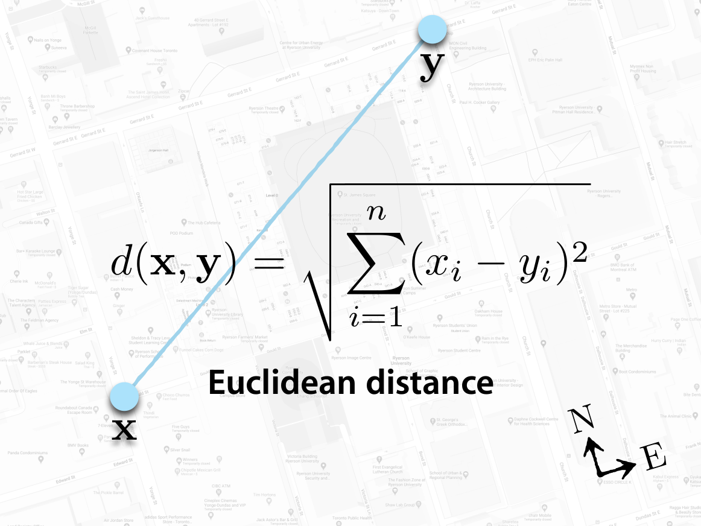
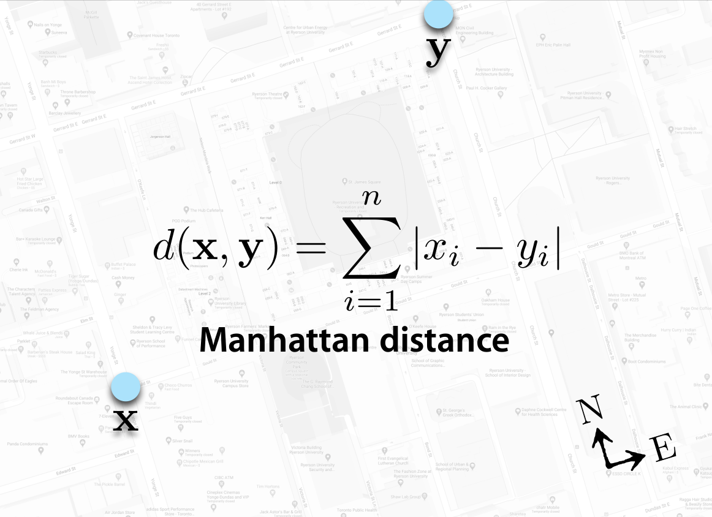
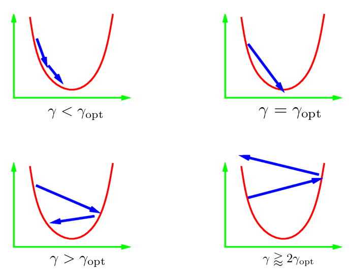

class: middle, center, title-slide

# Computer Vision

Lecture 5: Training neural networks

  
Yuriy Kochura 
[iuriy.kochura@gmail.com](mailto:iuriy.kochura@gmail.com)  
<a href="https://t.me/y_kochura">@y_kochura</a>  

---

# Today

How to **optimize parameters** efficiently?

- Gradient descent
- Stochastic Gradient Descent
- Mini-batching
- Momentum
- Adaptive methods:
    - AdaGrad
    - RMSProp
    - Adam

---

class: blue-slide, middle, center
count: false

.larger-xx[Parameters optimization]

---

class: middle

# A model

While what is inside of a deep neural network may be complex, at their core, they are simply functions. They take some input and generate some output.

.center.width-30[]

.footnote[Credits: NVIDIA]

---

class: middle

# Components of a model

.center.width-100[]

.footnote[Credits: NVIDIA]

???
The trained network consists of two components:
- A description of the architecture of the untrained network.
- The weights that were "learned" while the network trained.

---

class: middle

# A common training process for neural networks

1. Define a task + collect data
2. Initialize the parameters
3. Choose an optimization algorithm
4. Repeat these steps: 
.smaller-xx[
    4.1. Forward propagate an input

    4.2 Compute the cost function]
.smaller-xx[
    4.3 Compute the gradients of the cost with respect to parameters using backpropagation

    4.4 Update each parameter using the gradients, according to the optimization algorithm]

???
To build a machine learning algorithm, usually you’d define an architecture (e.g. Logistic regression, Support Vector Machine, Neural Network) and train it to learn parameters. Here is a common training process for neural networks.

Initialization can have a significant impact on convergence in training deep neural networks. Simple initialization schemes have been found to accelerate training, but they require some care to avoid common pitfalls.

Initializing all the weights with zeros leads the neurons to learn the same features during training. 

A too-large initialization leads to exploding gradients. That is, the gradients of the cost with the respect to the parameters are too big. This leads the cost to oscillate around its minimum value.

A too-small initialization leads to vanishing gradients. The gradients of the cost with respect to the parameters are too small, leading to convergence of the cost before it has reached the minimum value.

In machine learning, you start by defining a task and a model. The model consists of an architecture and parameters. For a given architecture, the values of the parameters determine how accurately the model performs the task. But how do you find good values? By defining a loss function that evaluates how well the model performs. The goal is to minimize the loss and thereby to find parameter values that match predictions with reality. This is the essence of training.

---

class: middle

# Common Loss functions

- Euclidean distance (L2 Loss)
- Mean Square Error (MSE)
- Manhattan distance (L1 Loss)
- Mean Absolute Error (MAE)
- Cross Entropy Loss

???
In mathematical optimization and decision theory, a loss function or cost function is a function that maps an event or values of one or more variables onto a real number intuitively representing some "cost" associated with the event. 

---

class: middle

.width-100[]

.footnote[Slide source: [Deep Learning in Computer Vision ](https://www.cs.ryerson.ca/~kosta/CP8309-F2018/index.html)]

???
It is a distance measure that best can be explained as the length of a segment connecting two points.

---

class: middle

# Euclidean distance (L2 Loss)

$$d(\hat y,y) = \sqrt{\sum\_{i=1}^n \left(\hat y^{(i)} - y^{(i)}\right)^2} = \left \Vert \hat y - y \right \Vert\_2$$
where $n$ is a total number of training examples

???
Euclidean distance works great when you have low-dimensional data and the magnitude of the vectors is important to be measured.

Although it is a common distance measure, Euclidean distance is not scale in-variant which means that distances computed might be skewed depending on the units of the features. Typically, one needs to normalize the data before using this distance measure.

---

class: middle

# Mean Square Error (MSE)

$$\begin{aligned}
\mathcal{L}(\hat y^{(i)}, y^{(i)}) &= (\hat y^{(i)} - y^{(i)})^2 \\\\
\mathcal{J}(\hat y,y) &= \frac{1}{n} \sqrt{\sum\_{i=1}^n \left(\hat y^{(i)} - y^{(i)}\right)^2} = \frac{1}{n} \left \Vert \hat y - y \right \Vert\_2
\end{aligned}$$
where $n$ is a total number of training examples

---

class: middle

.width-100[]

.footnote[Slide source: [Deep Learning in Computer Vision ](https://www.cs.ryerson.ca/~kosta/CP8309-F2018/index.html)]

---

class: middle

.width-100[]

.footnote[Slide source: [Deep Learning in Computer Vision ](https://www.cs.ryerson.ca/~kosta/CP8309-F2018/index.html)]

???
The Manhattan distance, often called Taxicab distance or City Block distance, calculates the distance between real-valued vectors. 

The distance between two points measured along axes at right angles.

---

class: middle

# Manhattan distance (L1 Loss)

$$d(\hat y,y) = \sum\_{i=1}^n |\hat y^{(i)} - y^{(i)}| = \left \Vert \hat y - y \right \Vert\_1$$
where $n$ is a total number of training examples

---

class: middle

# Mean Absolute Error (MAE)

$$\begin{aligned}
\mathcal{L}(\hat y^{(i)}, y^{(i)}) &= |\hat y^{(i)} - y^{(i)}| \\\\
\mathcal{J}(\hat y,y) &= \frac{1}{n} \sum_{i=1}^n |\hat y^{(i)} - y^{(i)}| = \frac{1}{n} \left \Vert \hat y - y \right \Vert_1
\end{aligned}$$
where $n$ is a total number of training examples

---

class: middle

# Cross Entropy Loss (binary)

$$\begin{aligned}
\mathcal{L}(\hat y^{(i)},y^{(i)}) &= - y^{(i)} \log(\hat{y}^{(i)}) + (1 - y^{(i)}) \log(1 - \hat{y}^{(i)}) \\\\
\mathcal{J}(\hat y,y)  &= - \frac{1}{n} \sum\_{i=1}^n \Big[ y^{(i)} \log(\hat{y}^{(i)}) + (1 - y^{(i)}) \log(1 - \hat{y}^{(i)}) \Big]
\end{aligned}$$
where $n$ is a total number of training examples

---

class: middle

## 9 Distance Measures in Data Science

.center.width-70[]

.footnote[Slide source: [9 Distance Measures in Data Science](https://towardsdatascience.com/9-distance-measures-in-data-science-918109d069fa)]

???
Cosine similarity has often been used as a way to counteract Euclidean distance’s problem with high dimensionality. The cosine similarity is simply the cosine of the angle between two vectors.

One main disadvantage of cosine similarity is that the magnitude of vectors is not taken into account, merely their direction. In practice, this means that the differences in values are not fully taken into account. 

We use cosine similarity often when we have high-dimensional data and when the magnitude of the vectors is not of importance. 

Hamming distance is the number of values that are different between two vectors. It is typically used to compare two binary strings of equal length. As you might expect, hamming distance is difficult to use when two vectors are not of equal length.Typical use cases include error correction/detection when data is transmitted over computer networks. It can be used to determine the number of distorted bits in a binary word as a way to estimate error.

Although Manhattan distance seems to work okay for high-dimensional data, it is a measure that is somewhat less intuitive than euclidean distance, especially when using in high-dimensional data. Moreover, it is more likely to give a higher distance value than euclidean distance since it does not the shortest path possible. This does not necessarily give issues but is something you should take into account. When your dataset has discrete and/or binary attributes, Manhattan seems to work quite well since it takes into account the paths that realistically could be taken within values of those attributes. 

Chebyshev distance is defined as the greatest of difference between two vectors along any coordinate dimension. In other words, it is simply the maximum distance along one axis.

The Jaccard index (or Intersection over Union) is a metric used to calculate the similarity and diversity of sample sets. It is the size of the intersection divided by the size of the union of the sample sets.

Haversine distance is the distance between two points on a sphere given their longitudes and latitudes.

The Sørensen-Dice index is very similar to Jaccard index in that it measures the similarity and diversity of sample sets.

---

.width-100[]

.footnote[Slide source: [Deep Learning in Computer Vision ](https://www.cs.ryerson.ca/~kosta/CP8309-F2018/index.html)]

---

class: middle

# Optimization algorithms

---

class: middle

# Hyperparameters & Parameters

- Result of optimization is a set of parameters
- Hyperparameters vs. Parameters

.grid[
.kol-1-2[
**Hyperparameters**
.smaller-xx[
- Train-test split ratio
- Learning rate in optimization algorithms
- Number of hidden layers in a NN
- Number of activation units in each layer
- Batch size

.center[$\vdots$]
]]
.kol-1-2[
**Parameters**
.smaller-xx[
- Weights and biases of a NN
- The cluster centroids in clustering
]]]

.footnote[Credits:: [Kizito Nyuytiymbiy](https://towardsdatascience.com/parameters-and-hyperparameters-aa609601a9ac)]

???
Hyperparameters are parameters whose values control the learning process and determine the values of model parameters that a learning algorithm ends up learning. The prefix ‘hyper_’ suggests that they are ‘top-level’ parameters that control the learning process and the model parameters that result from it.

Parameters on the other hand are internal to the model. That is, they are learned or estimated purely from the data during training as the algorithm used tries to learn the mapping between the input features and the labels or targets.

---

class: middle

# Problem of optimization

## Empirical risk minimization

$$W\_\*^\{\mathbf{d}} = \arg \min\_W \mathcal{J}(W) = \frac{1}{n} \sum\_{i=1}^n \mathcal{L}\left(y^{(i)}, f(\mathbf{x}^{(i)}, W)\right)$$

---

class: black-slide

.width-100[]

.footnote[Slide source: [Deep Learning in Computer Vision ](https://www.cs.ryerson.ca/~kosta/CP8309-F2018/index.html)]

---

class: middle

## A practical recommendation

Training a massive deep neural network is long, complex and sometimes confusing. 

A first step towards understanding, debugging and optimizing neural networks is to make use of visualization tools for
- plotting losses and metrics, 
- visualizing computational graphs,
- or showing additional data as the network is being trained.

---

background-image: url(figures/lec5/tensorboard.png)

???
TensorBoard provides the visualization and tooling needed for machine learning experimentation: 
- Tracking and visualizing metrics such as loss and accuracy
- Visualizing the model graph (ops and layers)
- Viewing histograms of weights, biases, or other tensors as they change over time
- Projecting embeddings to a lower dimensional space
- Displaying images, text, and audio data
- Profiling TensorFlow programs

---

class: middle, center

.larger-xx[[Demo](https://www.google.com/url?sa=t&rct=j&q=&esrc=s&source=web&cd=&cad=rja&uact=8&ved=2ahUKEwjYtYasjvnzAhUPCewKHYANDggQFnoECAQQAQ&url=https%3A%2F%2Fcolab.research.google.com%2Fgithub%2Ftensorflow%2Ftensorboard%2Fblob%2Fmaster%2Fdocs%2Ftensorboard_in_notebooks.ipynb&usg=AOvVaw1vAk6hbwao2KtXBNnZ1cez)]

---

class: blue-slide, middle, center
count: false

.larger-xx[Gradient Descent 

GD]

---

class: middle

# Gradient descent

To minimize $\mathcal{J}(W)$, 
standard **batch gradient descent** (GD) consists in applying the update rule
$$\begin{aligned}
g\_t &= \frac{1}{n} \sum\_{i=1}^n \nabla\_W \mathcal{L}\left(y^{(i)}, f(\mathbf{x}^{(i)}, W)\right) = \nabla\_W \mathcal{J}(W)\\\\
W\_{t+1} &= W\_t - \alpha g\_t,
\end{aligned}$$
where $\alpha$ is the learning rate.
.center.width-60[]

---

class: middle

# GD

.larger-x[The worst optimization method in the world]

.alert[Side note: You should probably never use gradient descent directly, consider it a building block for other methods.]

.footnote[Credits: Aaron Defazio, Facebook AI Research]

---

class: middle

# Learning Rate

.center.width-70[]

Here $\gamma = \alpha$ is the learning rate.

.footnote[Credits: Aaron Defazio, Facebook AI Research]

???
The learning rate $\gamma = \alpha$ can be set by the algorithm designer. If we use a learning rate that is too small, it will cause $W$ to update very slowly, requiring more iterations to get a better solution.

Typically we don't have a good estimate of the learning rate. Standard practice is to try a bunch of values on a log scale and use the one that gave the best final result.

Learning rates that are too large cause divergence where the function value (loss) explodes.

The optimal learning rate can change during optimization! Often decreasing it over time is necessary.

---

class: black-slide

.width-100[]

.footnote[Slide source: [Deep Learning in Computer Vision ](https://www.cs.ryerson.ca/~kosta/CP8309-F2018/index.html)]

???
The empirical risk is an average loss on the training dataset while the risk is the expected loss on the entire population of data.

There are many challenges in deep learning optimization. Some of the most vexing ones are local minima, saddle points, and vanishing gradients.

---

class: black-slide

.width-100[]

.footnote[Slide source: [Deep Learning in Computer Vision ](https://www.cs.ryerson.ca/~kosta/CP8309-F2018/index.html)]

???
For any objective function $\mathcal{J}(W)$, if the value of $\mathcal{J}(W)$ at $W$ is smaller than the values of $W$ at any other points in the vicinity of $W$, then $\mathcal{J}(W)$ could be a local minimum. If the value of $\mathcal{J}(W)$ at $W$ is the minimum of the objective function over the entire domain, then $\mathcal{J}(W)$ is the global minimum.

---

class: middle

.center[
<video loop controls preload="auto" height="600" width="600">
  <source src="./figures/lec5/opt-gd.mp4" type="video/mp4">
</video>
]

---

class: blue-slide, middle, center
count: false

.larger-xx[Stochastic Gradient Descent 

SGD]

---

class: middle

# SGD

To reduce the computational complexity, **stochastic gradient descent** (SGD) consists in updating the parameters after every sample
$$\begin{aligned}
\ell^{(i)} &= \mathcal{L}\left(y^{(i)}, f(\mathbf{x}^{(i)}, W)\right) \\\\
g^{(i)}\_t &= \nabla\_W \ell^{(i)} \\\\
W\_{t+1} &= W\_t - \alpha g^{(i)}\_t
\end{aligned}$$

???
In deep learning, the objective function is usually the average of the loss functions for each example in the training dataset. Given a training dataset of $n$ examples, we assume that $\ell^{(i)}$ is the loss function with respect to the training example of index $i$, where $W$ is the parameter vector.

---

class: middle

# Advantages of SGD

- Stochastic gradients are drastically cheaper to compute (proportional to
your dataset size), so you can often take thousands of SGD steps for the cost of one GD step.

- On average, the stochastic gradient is a good estimate of the gradient.

- The noise can prevent the optimizing converging to bad local minima, a
phenomena called annealing.

.footnote[Credits: Aaron Defazio, Facebook AI Research]

---

class: blue-slide, middle, center
count: false

.larger-xx[Mini-batching]

---

class: middle

# Mini-batching

Visiting the samples in mini-batches and updating the parameters each time
$$
\begin{aligned}
g^{(k)}\_t &= \frac{1}{B} \sum\_{i=1}^B \nabla\_W \mathcal{L}\left(y\_k^{(i)}, f(\mathbf{x}\_k^{(i)}, W)\right) \\\\
W\_{t+1} &= W\_t - \alpha g^{(k)}\_t,
\end{aligned}
$$
where $k$ is an index of mini-batch.

- Increasing the batch size $B$ reduces the variance of the gradient estimates and enables the speed-up of batch processing.
- The interplay between $B$ and $\alpha$ is still unclear.

---

class: blue-slide, middle, center
count: false

.larger-xx[Momentum]

---

class: middle

# Momentum

SGD + Momentum = Stochastic *heavy ball* method

$$
\begin{aligned}
p\_{t + 1} &= \beta\_t p\_{t} + \nabla \ell^{(i)} (W\_t)\\\\
W\_{t+1} &= W\_t - \alpha\_t p\_{t + 1}
\end{aligned}
$$

Rule for updating:

$$
\begin{aligned}
W\_{t+1} &= W\_t - \alpha\_t \nabla \ell^{(i)} (W\_t) + \beta\_t \left(W\_{t} - W\_{t-1}\right)
\end{aligned}
$$

**Key idea:** The next step becomes a combination of the previous step’s direction and the new negative gradient.

???
Momentum replaces gradients with a leaky average over past gradients. This accelerates convergence significantly. Momentum usually speeds up the learning with a very minor implementation change. 

---

<iframe class="iframemomentum" src="https://distill.pub/2017/momentum/" scrolling="no" frameborder="no"  style="position:absolute; top:-165px; left: -25px; width:950px; height: 600px"></iframe>

.footnote[Credits:  Distill, [Why Momentum Really Works?](https://distill.pub/2017/momentum/)]

???
**Intuition.** The optimization process resembles a **heavy ball** rolling down a hill. The ball has **momentum**, so it doesn’t change direction immediately when it encounters changes to the landscape!

---

class: middle, black-slide

.center[
<video loop controls preload="auto" height="500" width="600">
  <source src="./figures/lec5/sgd-momentum.mp4" type="video/mp4">
</video>
]

.footnote[Image credits: Kosta Derpanis, [Deep Learning in Computer Vision](https://www.cs.ryerson.ca/~kosta/CP8309-F2018/index.html), 2018]

---

class: middle

# Advantages

SGD with momentum has **three** nice properties:
- it can go through local barriers
- it accelerates if the gradient does not change much
- it dampens oscillations in narrow valleys

---

class: middle

## Practical Aspects of momentum

It’s basically **“free lunch”**, in almost all situations, **SGD + momentum** is better than SGD, and very rarely worse!

## Recommended Parameters:

$\beta = 0.9$ or $0.99$ almost always works well. Sometimes slight gains can be had by tuning it.

The step size parameter ($\alpha$) usually needs to be decreased when the momentum parameter is increased to maintain convergence.

.footnote[Credits: Aaron Defazio, Facebook AI Research]

---

class: middle, center

.larger-xx[[Demo](https://www.deeplearning.ai/ai-notes/optimization/)]

---

class: blue-slide, middle, center
count: false

.larger-xx[Adaptive methods]

---

class: middle

# Adaptive methods

The magnitude of the gradients often varies highly between layers due to, so a global learning rate may not work well.

*General IDEA:* Instead of using the same learning rate for every weight in our network, **maintain an estimate of a better rate separately for each weight**.

The exact way of adapting to the learning rates varies between algorithms, but most methods either **adapt** to the **variance of the weights**, or to the **local curvature** of the problem.

.footnote[Credits: Aaron Defazio, Facebook AI Research]

---

class: middle

## AdaGrad

Per-parameter downscale by square-root of sum of squares of all its historical values.

$$\begin{aligned}
r\_t  &=  r\_{t-1} + g\_t \odot g\_t \\\\
W\_{t+1} &= W\_t - \frac{\alpha}{\varepsilon + \sqrt{r\_t}} \odot g\_t
\end{aligned}$$

- AdaGrad eliminates the need to manually tune the learning rate.
  Most implementation use $\alpha=0.01$ as default.
- It is good when the objective is convex.
- $r_t$ grows unboundedly during training, which may cause the step size to shrink and eventually become infinitesimally small.
- $\delta$ is an additive constant that ensures that we do not divide by 0.

???
The variable $r\_t$ accumulates past gradient variance.

---

class: middle

## RMSProp

Same as AdaGrad but accumulate an exponentially decaying average of the gradient.

**Key IDEA:** normalize by the root-mean-square of the gradient

$$\begin{aligned}
r\_t  &=  \rho r\_{t-1} + (1-\rho) g\_t \odot g\_t \\\\
W\_{t+1} &= W\_t - \frac{\alpha}{\varepsilon + \sqrt{r\_t}} \odot g\_t
\end{aligned}$$

- Perform better in non-convex settings.

???
An alternative is to use a leaky average in the same way we used in the momentum method, for some parameter $\rho>0$.

---

class: middle

## Adam: RMSprop with a kind of momen

.smaller-xx[“Adaptive Moment Estimation”]

Similar to RMSProp with momentum, but with bias correction terms for the first and second moments.

$$\begin{aligned}
p\_t  &=  \rho\_1 p\_{t-1} + (1-\rho\_1) g\_t \\\\
\hat{p}\_t &= \frac{p\_t}{1-\rho\_1^t} \\\\
r\_t  &=  \rho\_2 r\_{t-1} + (1-\rho\_2) g\_t \odot g\_t \\\\
\hat{r}\_t &= \frac{r\_t}{1-\rho\_2^t} \\\\
W\_{t+1} &= W\_t - \alpha \frac{\hat{p}\_t}{\varepsilon+\sqrt{\hat{r}\_t}}
\end{aligned}$$

- Good defaults are $\rho\_1=0.9$ and $\rho\_2=0.999$.
- Just as momentum improves SGD, it improves RMSProp as well.

???
Adam is one of the **default optimizers** in deep learning, along with SGD with momentum.

---

# Practical side

For poorly conditioned problems, Adam is often much better than SGD.

Use Adam over RMSprop due to the clear advantages of momentum.

## BUT, Adam is poorly understood theoretically, and has known disadvantages:

- Does not converge at all on some simple example problems!
- Gives worse generalization error on many computer vision problems (i.e. ImageNet)
- Requires more memory than SGD
- Has 2 momentum parameters, so some tuning may be needed

.footnote[Credits: Aaron Defazio, Facebook AI Research]

---

class: middle, center

.larger-xx[[Demo](https://www.deeplearning.ai/ai-notes/optimization/)]

---

class: middle, center

.larger-xx[[demo - losslandscape](https://losslandscape.com/explorer)]

---

class: end-slide, center
count: false

.larger-xx[The end]

