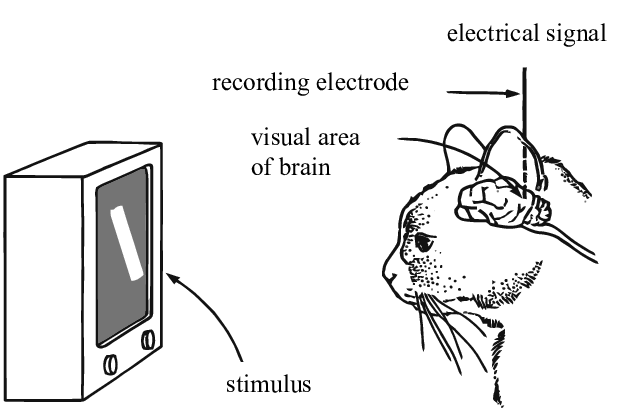
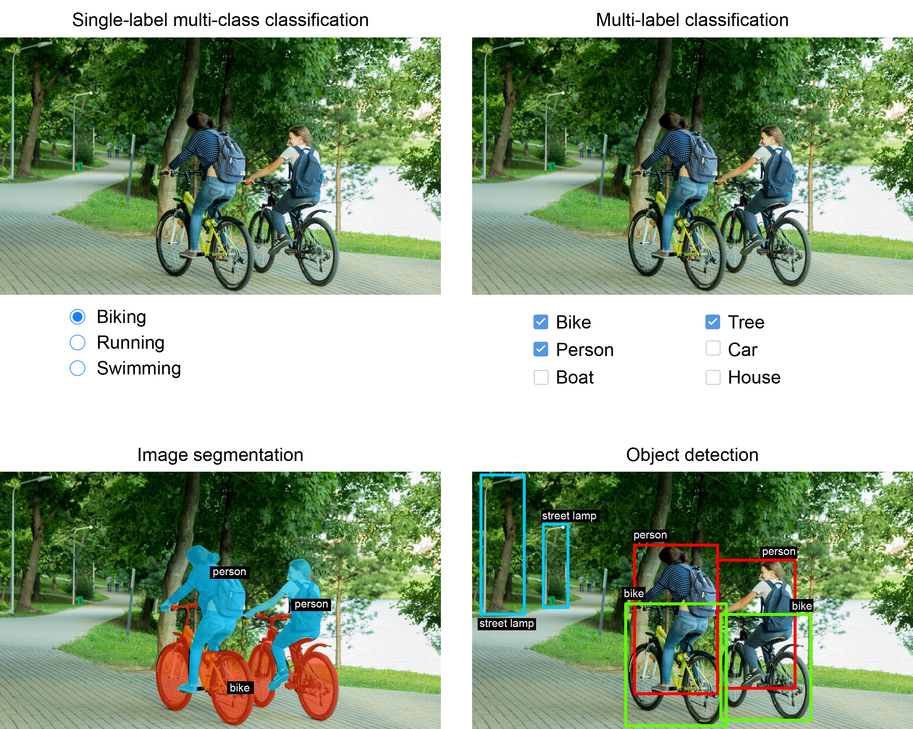

class: middle, center, title-slide

# Computer Vision

Lecture 6: Computer vision

  
Yuriy Kochura 
[iuriy.kochura@gmail.com](mailto:iuriy.kochura@gmail.com)  
<a href="https://t.me/y_kochura">@y_kochura</a>  

???
The core concept of any AI system is that it can perceive its environment and take actions based on its perceptions. **Computer vision** is concerned with the visual perception part: it is the science of perceiving and understanding the world through images and videos by constructing a physical model of the world so that an AI system can then take appropriate actions. For humans, vision is only one aspect of perception. We perceive the world through our sight, but also through sound, smell, and our other senses. It is similar with AI systems—vision is just one way to understand the world. Depending on the application you are building, you select the sensing device that best captures the world.

---

# Today

How to **make neural networks see**?

- Visual perception
- Human vision system
- Computer vision system
- Applications of computer vision

---

class: blue-slide, middle, center
count: false

.larger-xx[Visual perception]

---

# Visual perception 

In 1959-1962, David Hubel and Torsten Wiesel discover the neural basis of information processing in the **visual system**.
They are awarded the Nobel Prize of Medicine in 1981 for their discovery.

.grid.center[
.kol-4-5.center[.width-80[]]
.kol-1-5[ .width-100.circle[].width-100.circle[]]
]

???
Visual perception, at its most basic, is the act of observing patterns and objects through sight or visual input. With an autonomous vehicle, for example, visual perception means understanding the surrounding objects and their specific details—such as pedestrians, or whether there is a particular lane the vehicle needs to be centered in—and detecting traffic signs and understanding what they mean. That’s why the word perception is part of the definition. We are not just looking to capture the surrounding environment. We are trying to build systems that can actually understand that environment through visual input.

---

class: middle, larger-x

# Vision systems

.success[In past decades, traditional image-processing techniques were considered CV systems, but that is not totally accurate. A machine processing an image is completely different from that machine understanding what’s happening within the image, which is not a trivial task. Image processing is now just a piece of a bigger, more complex system that aims to interpret image content.]

.footnote[Credits: Mohamed Elgendy. Deep Learning for Vision Systems, 2020.]

---

class: middle

# Human vision system

.center.width-100[]

.footnote[Credits: Mohamed Elgendy. Deep Learning for Vision Systems, 2020.]

???
At the highest level, vision systems are pretty much the same for humans, animals, insects, and most living organisms. They consist of a sensor or an eye to capture the image and a brain to process and interpret the image. The system then outputs a prediction of the image components based on the data extracted from the image. 

Let’s see how the human vision system works. Suppose we want to interpret the image of dogs in the figure you see on this slide. We look at it and directly understand that the image consists of a bunch of dogs (three, to be specific). It comes pretty natural to us to classify and detect objects in this image because we have been trained over the years to identify dogs.

.larger-x[The human vision system uses the eye and brain to sense and interpret an image.]

---

class: middle

# Computer vision system

.center.width-100[]

.footnote[Credits: Mohamed Elgendy. Deep Learning for Vision Systems, 2020.]

???
Scientists were inspired by the human vision system and in recent years have done an amazing job of copying visual ability with machines. To mimic the human vision system, we need the same two main components: a sensing device to mimic the function of the eye and a powerful algorithm to mimic the brain function in interpreting and classifying image content (see the figure at the slide).

.larger-x[The components of the computer vision system are a sensing device and an interpreting device.]

---

class: middle

# Sensing devices

Let’s look at the autonomous vehicle (AV) example.

.success[The main goal of the AV vision system is to allow the car to understand the environment around it and move from point A to point B safely and in a timely manner. To fulfill this goal, vehicles are equipped with a combination of cameras and sensors that can detect 360 degrees of movement &mdash; pedestrians, cyclists, vehicles, roadwork, and other objects &mdash; from up to three football fields away.]

Here are some of the sensing devices usually used in self-driving cars to perceive the surrounding area:
- Lidar, a radar-like technique, uses invisible pulses of light to create a high-resolution 3D map of the surrounding area.
- Cameras can see street signs and road markings but cannot measure distance.
- Radar can measure distance and velocity but cannot see in fine detail.

.footnote[Credits: Mohamed Elgendy. Deep Learning for Vision Systems, 2020.]

???
Vision systems are designed to fulfill a specific task. An important aspect of design is selecting the best sensing device to capture the surroundings of a specific environment, whether that is a camera, radar, X-ray, CT scan, Lidar, or a combination of devices to provide the full scene of an environment to fulfill the task at hand.

Medical diagnosis applications use X-rays or CT scans as sensing devices.

---

class: middle

# Recognizing images

.alert.smaller-xx[Animals, humans, and insects all have eyes as sensing devices. But not all eyes have the same structure, output image quality, and resolution. They are tailored to the specific needs of the creature. Bees, for instance, and many other insects, have compound eyes that consist of multiple lenses (as many as 30,000 lenses in a single compound eye). Compound eyes have low resolution, which makes them not so good at recognizing objects at a far distance. But they are very sensitive to motion, which is essential for survival while flying at high speed. Bees don’t need high-resolution pictures. Their vision systems are built to allow them to pick up the smallest movements while flying fast.]

.center.width-90[]

.footnote[Credits: Mohamed Elgendy. Deep Learning for Vision Systems, 2020.]

???
Animals, humans, and insects all have eyes as sensing devices. But not all eyes have the same structure, output image quality, and resolution. They are tailored to the specific needs of the creature. Bees, for instance, and many other insects, have compound eyes that consist of multiple lenses (as many as 30,000 lenses in a single compound eye). Compound eyes have low resolution, which makes them not so good at recognizing objects at a far distance. But they are very sensitive to motion, which is essential for survival while flying at high speed. Bees don’t need high-resolution pictures. Their vision systems are built to allow them to pick up the smallest movements while flying fast.

---

class: middle

# Interpreting devices

.width-100[]

???
Computer vision algorithms are typically employed as interpreting devices. The interpreter is the brain of the vision system. Its role is to take the output image from the sensing device and learn features and patterns to identify objects. So we need to build a brain. Simple! Scientists were inspired by how our brains work and tried to reverse engineer the central nervous system to get some insight on how to build an artificial
brain. Thus, artificial neural networks (ANNs) were born (see an example in the  figure on this slide).

The learning behavior of biological neurons inspired scientists to create a network of neurons that are connected to each other. Imitating how information is processed in the human brain, each artificial neuron fires a signal to all the neurons that it’s connected to when enough of its input signals are activated. Thus, neurons have a very simple mechanism on the individual level; but when you have millions of these neurons stacked in layers and connected together, each neuron is connected to thousands of other neurons, yielding a learning behavior. Building a multilayer neural network is called deep learning.

---

class: middle

## Can machine learning achieve better performance than the human brain? 

.success[Recent AI and DL advances have allowed machines to surpass human visual ability in many image classification and object detection applications, and capacity is rapidly expanding to many other applications.]

.footnote[Credits: Mohamed Elgendy. Deep Learning for Vision Systems, 2020.]

---

class: middle

# Applications of computer vision

.width-90[]

.footnote[Credits: Francois Chollet. Deep Learning with Python, 2021.]

???
There are **three** essential computer vision tasks

---

class: middle

# Image classification

.success[The goal is to assign one or more labels to an image. It may be either single-label classification (an image can only be in one category, excluding the others), or multi-label classification (tagging all categories that an image belongs to, as seen in the figure on the previous slide). 

.smaller-x[For example, when you search for a keyword on the Google Photos app, behind the scenes you’re querying a very large multilabel classification model—one with over 20,000 different classes, trained on millions of images.]]

.footnote[Credits: Francois Chollet. Deep Learning with Python, 2021.]

???
The goal is to assign one or more labels to an image. It may be either single-label classification (an image can only be in one category, excluding the others), or multi-label classification (tagging all categories that an image belongs to, as seen in the figure on the previous slide). 

For example, when you search for a keyword on the Google Photos app, behind the scenes you’re querying a very large multilabel classification model—one with over 20,000 different classes, trained on millions of images.

---

class: middle

# Object detection

.success[The goal is to draw rectangles (called *bounding boxes*) around objects of interest in an image, and associate each rectangle with a class. 

.smaller-x[A self-driving car could use an object-detection model to monitor cars, pedestrians, and signs in view of its cameras, for instance.]]

.footnote[Credits: Francois Chollet. Deep Learning with Python, 2021.]

???
The goal is to draw rectangles (called *bounding boxes*) around objects of interest in an image, and associate each rectangle with a class.

A self-driving car could use an object-detection model to monitor cars, pedestrians, and signs in view of its cameras, for instance.

---

class: middle

# Image segmentation

.success[The the goal is to ''segment'' or ''partition'' an image into different areas, with each area usually representing a category (as as seen in the figure on the **Applications of computer vision** slide). 

.smaller-x[For instance, when Zoom or Google Meet diplays a custom background behind you in a video call, it’s using an image segmentation model to tell your face apart from what’s behind it, at pixel precision.]]

.footnote[Credits: Francois Chollet. Deep Learning with Python, 2021.]

???
The the goal is to ``segment'' or ``partition'' an image into different areas, with each area usually representing a category (as as seen in the figure on the **Applications of computer vision** slide).

For instance, when Zoom or Google Meet diplays a custom background behind you in a video call, it’s using an image segmentation model to tell your face apart from what’s behind it, at pixel precision.

---

class: middle

# An image segmentation example

.width-100[]

.grid[
.center.kol-1-2[Semantic segmentation]
.center.kol-1-2[Instance segmentation]]

.footnote[Credits: Francois Chollet. Deep Learning with Python, 2021.]

???
- Semantic segmentation, where each pixel is independently classified into a semantic category, like “cat.” If there are two cats in the image, the corresponding pixels are all mapped to the same generic “cat” category.

- Instance segmentation, which seeks not only to classify image pixels by category, but also to parse out individual object instances. In an image with two cats in it, instance segmentation would treat “cat 1” and “cat 2” as two separate classes of pixels.

---

class: middle, center

# Demo

.larger-x[[Computer Vision Explorer](https://vision-explorer.allenai.org/classification)]

---

class: end-slide, center
count: false

.larger-xx[The end]

