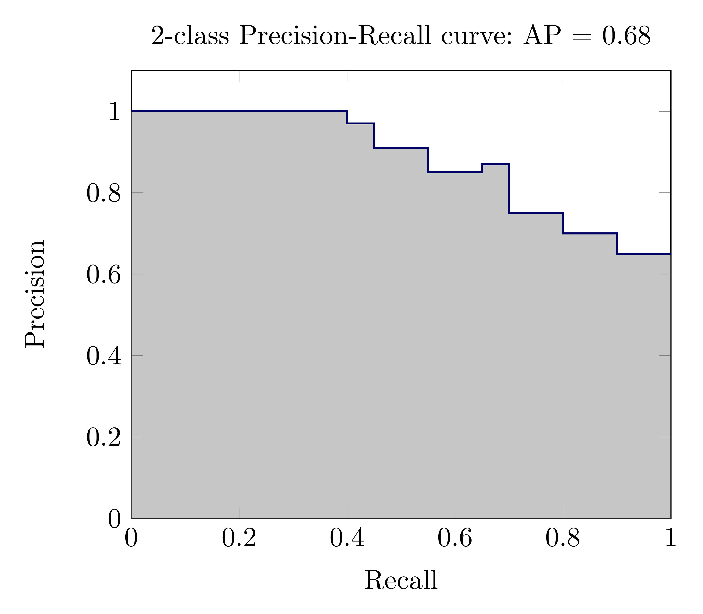

class: middle, center, title-slide

# Computer Vision

Lecture 7: Evaluation Metrics for CV

  
Yuriy Kochura 
[iuriy.kochura@gmail.com](mailto:iuriy.kochura@gmail.com)  
<a href="https://t.me/y_kochura">@y_kochura</a>  

???
Deep learning tasks can be complex and hard to measure: how do we know whether one network is better than another? In some simpler cases such as regression, the loss function used to train a network can be a good measurement of the network’s performance. However, for many real-world tasks, there are evaluation metrics that encapsulate, in a single number, how well a network is doing in terms of real world performance. These evaluation metrics allow us to quickly see the quality of a model, and easily compare different models on the same tasks. Next, we’ll go through some case studies of different tasks and their metrics.

---

# Today

How to measure a **quality of a model, and easily compare different models on the same tasks**?

- Classification
	- Accuracy
	- Precision
	- Recall
	- F1 Score
- Object Detection
	- Intersection over Union (IoU)
	- Average Precision (AP): the Area Under Curve (AUC)
	- Mean Average Precision (mAP)

---

class: blue-slide, middle, center
count: false

.larger-xx[Classification]

---

class: middle
# Confusion Matrix 

.center.width-45[]

.smaller-x[
- True Positive (TP): Correctly identified as relevant
- True Negative (TN): Correctly identified as not relevant
- False Positive (FP): Incorrectly labeled as relevant
- False Negative (FN): Incorrectly labeled as not relevant
]

???
A **confusion matrix**, also known as an **error matrix** is a specific table layout that allows visualization of the performance of an algorithm, typically a supervised learning one.

---

class: middle

# Example1: Identify Cats

.center.width-100[]

---

class: middle

# Example2: Identify pneumonia

.center.width-100[]

.footnote[Credits: Andrew Ng and Kian Katanforoosh. CS230 Deep Learning.]

???
Let’s consider a simple binary classification problem, where we are trying to predict if a patient is healthy or has pneumonia. We have a test set with 10 patients, where 9 patients are healthy (shown as green squares) and 1 patient has pneumonia (shown as a red square).

We trained 3 models for this task (Model1, Model2, Model3), and we’d like to compare the performance of these models. The predictions from each model on the test set are shown below.

---

class: middle 

# Accuracy

.grid.center[
.kol-1-2.center[
.center.width-60[]]
.kol-1-2[ .center.width-100[]]
]

.smaller-x[

$$\text{Accuracy} = \frac{TP + TN}{TP + TN + FP + FN}$$

If we use accuracy as your evaluation metric, it seems that the best model is Model1:

$$\begin{aligned}
\text{Accuracy($M\_1$)}  = \frac{9}{10} &&  \text{Accuracy($M\_2$)}  = \frac{8}{10} &&  \text{Accuracy($M\_3$)}  = \frac{5}{10}
\end{aligned}$$

]

.footnote[Credits: Andrew Ng and Kian Katanforoosh. CS230 Deep Learning.]

???
To compare the models, we could first use accuracy, which is the number of correctly classified examples divided by the total.

In general, when you have class imbalance (which is most of the time!), accuracy is not a good metric to use.

---

class: middle 

# Recall

.grid.center[
.kol-1-2.center[
.center.width-60[]]
.kol-1-2[ .center.width-100[]]
]

.smaller-x[

$$\text{Recall} = \frac{TP}{TP + FN}$$

What is the recall for each model?

$$\begin{aligned}
\text{Recall($M\_1$)}  = \frac{0}{1} &&  \text{Recall($M\_2$)}  = \frac{1}{1} &&  \text{Recall($M\_3$)}  = \frac{1}{1}
\end{aligned}$$

]

.footnote[Credits: Andrew Ng and Kian Katanforoosh. CS230 Deep Learning.]

???
For pneumonia detection, it is crucial that we find all the patients that have pneumonia. Predicting patients with pneumonia as healthy is not acceptable (since the patients will be left untreated). Thus, a natural question to ask when evaluating our models is: *Out of all the patients with pneumonia, how many did the model predict as having pneumonia?*

This metric is recall, which is expressed as the following (Percentage of actual positive examples that are correctly predicted).

---

class: middle 

# Precision

.grid.center[
.kol-1-2.center[
.center.width-60[]]
.kol-1-2[ .center.width-100[]]
]

.smaller-x[

$$\text{Precision} = \frac{TP}{TP + FP}$$

What is the precision for each model?

$$\begin{aligned}
\text{Precision($M\_1$)}  = \frac{0}{0} &&  \text{Precision($M\_2$)}  = \frac{1}{3} &&  \text{Precision($M\_3$)}  = \frac{1}{6}
\end{aligned}$$

]

.footnote[Credits: Andrew Ng and Kian Katanforoosh. CS230 Deep Learning.]

???
Imagine that the treatment for pneumonia is very costly and therefore you would also like to make sure only patients with pneumonia receive treatment. A natural question to ask would be: *Out of all the patients that are predicted to have pneumonia, how many actually have pneumonia?*

This metric is precision, which is expressed as the following (Percentage of positive examples that are correctly predicted).

---

class: middle 

# F1 score

.smaller-x[

$$F\_1 = \frac{2}{\frac{1}{\text{Precision}} + \frac{1}{\text{Recall}}} = 2 \cdot \frac{\text{Precision} \cdot \text{Recall}}{\text{Precision} + \text{Recall}}$$

What is the F1 score for each model?

$$\begin{aligned}
F\_1(M\_1)  = 0 &&  F\_1(M\_2)  = \frac{1}{2} &&  F\_1(M\_3)  = \frac{2}{7}
\end{aligned}$$

]

.footnote[Credits: Andrew Ng and Kian Katanforoosh. CS230 Deep Learning.]

???
Precision and recall are both useful, but having multiple evaluation metrics makes it difficult to directly compare models. From Andrew Ng’s machine learning book:

.italic[“Having multiple-number evaluation metrics makes it harder to compare algorithms. Better to combine them to a single evaluation metric. Having a single-number evaluation metric speeds up your ability to make a decision when you are selecting among a large number of classifiers. It gives a clear preference ranking among all of them, and therefore a clear direction for progress.”] - Machine Learning Yearning

F1 score is a metric that combines recall and precision by taking their harmonic mean.

---

class: blue-slide, middle, center
count: false

.larger-xx[Object Detection]

???
In object detection, two primary metrics are used: intersection over union (IoU) and mean average precision (mAP). Let’s look on a small example.

---

class: middle

# Intersection over Union (IoU)

.center.width-100[]

???
Object detection involves finding objects, classifying them, and localizing them by drawing bounding boxes around them. Intersection over union is an intuitive metric that measures the goodness of fit of a bounding box.

The higher the IoU, the better the fit. IoU is a great metric since it works well for any size and shape of object. This per-object metric, along with precision and recall, form the basis for the full object detection metric, mean average precision (mAP).

---

class: middle

## Average Precision (AP): the Area Under Curve (AUC)

.center.width-80[]

???
Object detectors create multiple predictions: each image can have multiple predicted objects, and there are many images to run inference on. Each predicted object has a confidence assigned with it: this is how confident the detector is in its prediction.

We can choose different confidence thresholds to use, to decide which predictions to accept from the detector. For instance, if we set the threshold to 0.7, then any predictions with confidence greater than 0.7 are accepted, and the low confidence predictions are discarded. Since there are so many different thresholds to choose, how do we summarize the performance of the detector?

The answer uses a precision-recall curve. At each confidence threshold, we can measure the precision and recall of the detector, giving us one data point. If we connect these points together, one for each threshold, we get a precision recall curve like the following.

The better the model, the higher the precision and recall at its points: this pushes the boundary of the curve (the dark line) towards the top and right. We can summarize the performance of the model with one metric, by taking the area under the curve (shown in gray). This gives us a number between 0 and 1, where higher is better. This metric is commonly known as average precision (AP).

---

class: middle, center

# Demo

.larger-x[[Evaluation Metrics](https://www.kaggle.com/kyuriy/evaluation-metrics-for-multi-class-classification)]

---

class: end-slide, center
count: false

.larger-xx[The end]

