class: middle, center, title-slide

# Computer Vision

Lecture 8: Computer vision pipeline

  
Yuriy Kochura 
[iuriy.kochura@gmail.com](mailto:iuriy.kochura@gmail.com)  
<a href="https://t.me/y_kochura">@y_kochura</a>  

???
Computer vision is the earliest and biggest success story of deep learning. Every day, you’re interacting with deep vision models &mdash; via Google Photos, Google image search, YouTube, video filters in camera apps, Optical Character Recognition (OCR) software, and many more. These models are also at the heart of cutting-edge research in autonomous driving, robotics, AI-assisted medical diagnosis, autonomous retail checkout systems, and even autonomous farming.

Computer vision is the problem domain that led to the initial rise of deep learning between 2011 and 2015. A type of deep learning model called convolutional
neural networks started getting remarkably good results on image classification competitions around that time, first with Dan Ciresan winning two niche competitions (the ICDAR 2011 Chinese character recognition competition and the IJCNN 2011 German traffic signs recognition competition), and then more notably in fall 2012 with Hinton’s group winning the high-profile ImageNet large-scale visual recognition challenge. Many more promising results quickly started bubbling up in other computer vision tasks.

Interestingly, these early successes weren’t quite enough to make deep learning mainstream at the time—it took a few years. The computer vision research community had spent many years investing in methods other than neural networks, and it wasn’t quite ready to give up on them just because there was a new kid on the block. In 2013 and 2014, deep learning still faced intense skepticism from many senior computer vision researchers. It was only in 2016 that it finally became dominant.

This lecture introduces Computer Vision pipeline.

---

# Today

Sequence of distinct steps to process and analyze image data

- Input data
- Preprocessing
- Feature extraction

---

class: middle

# Computer vision system

.center.width-100[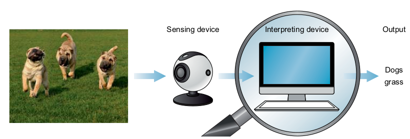]

.footnote[Credits: Mohamed Elgendy. Deep Learning for Vision Systems, 2020.]

???
Scientists were inspired by the human vision system and in recent years have done an amazing job of copying visual ability with machines. To mimic the human vision system, we need the same two main components: a sensing device to mimic the function of the eye and a powerful algorithm to mimic the brain function in interpreting and classifying image content.

.larger-x[The components of the computer vision system are a sensing device and an interpreting device.]

Let’s dive one level deeper into CV systems. Remember that earlier, we discussed how vision systems are composed of two main components: sensing devices and interpreting devices. Now, we will take a look at the pipeline the interpreting device component uses to process and understand images.

---

class: middle

# The computer vision pipeline

.center.width-100[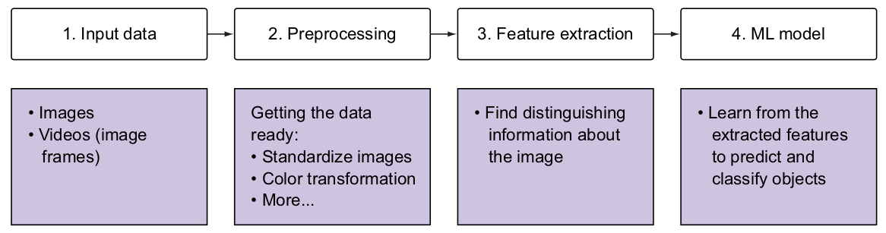]

.footnote[Credits: Mohamed Elgendy. Deep Learning for Vision Systems, 2020.]

???
Applications of CV vary, but a typical vision system uses a sequence of distinct steps to process and analyze image data. These steps are referred to as a *computer vision pipeline*. Many vision applications follow the flow of acquiring images and data, processing that data, performing some analysis and recognition steps, and then finally making a prediction based on the extracted information.

The computer vision pipeline, which takes input data, processes it, extracts information, and then sends it to the machine learning model to learn.

---

class: middle

# The computer vision pipeline
## Today

.center.width-100[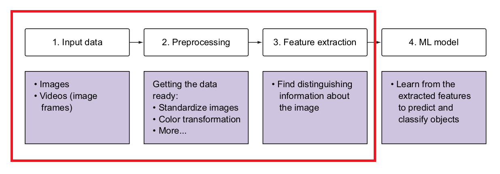]

.footnote[Credits: Mohamed Elgendy. Deep Learning for Vision Systems, 2020.]

---

class: middle

# The computer vision pipeline

.center.width-100[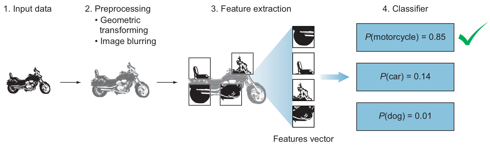]

.alert[*Definition.* An **image classifier** is an algorithm that takes in an image as input and outputs a label or “class” that identifies that image. A **class** (also called a category) in machine learning is the output category of your data.]

.footnote[Credits: Mohamed Elgendy. Deep Learning for Vision Systems, 2020.]

???
Let’s apply this pipeline to an image classifier example. Suppose we have an image of a motorcycle, and we want the model to predict the probability of the
object from the following classes: motorcycle, car, and dog.

Here is how the image flows through the classification pipeline:
1. A computer receives visual input from an imaging device like a camera. This input is typically captured as an image or a sequence of images forming a video.
2. Each image is then sent through some preprocessing steps whose purpose is to standardize the images. Common preprocessing steps include resizing an
image, blurring, rotating, changing its shape, or transforming the image from one color to another, such as from color to grayscale. Only by standardizing the
images—for example, making them the same size—can you then compare them and further analyze them.
3. We extract features. Features are what help us define objects, and they are usually information about object shape or color. For example, some features that
distinguish a motorcycle are the shape of the wheels, headlights, mudguards, and so on. The output of this process is a feature vector that is a list of unique
shapes that identify the object. 
4. The features are fed into a classification model. This step looks at the feature vector from the previous step and predicts the class of the image. Pretend that you are the classifier model for a few minutes, and let’s go through the classification process. You look at the list of features in the feature vector one by one and try to determine what’s in the image:
	- First you see a *wheel* feature; could this be a car, a motorcycle, or a dog? Clearly it is not a dog, because dogs don’t have wheels (at least, normal dogs,not robots). Then this could be an image of a car or a motorcycle.
	 - You move on to the next feature, the *headlights*. There is a higher probability that this is a motorcycle than a car.
	 - The next feature is rear *mudguards* &mdash; again, there is a higher probability that it is a motorcycle.
	 - The object has only two wheels; this is closer to a motorcycle.
	 - And you keep going through all the features like the body shape, pedal, and so on, until you arrive at the best guess of the object in the image.

The output of this process is the probability of each class. As you can see in our example, the dog has the lowest probability, 1%, whereas there is an 85% probability that this is a motorcycle. Now, let's dive in one level deeper on each of the pipeline steps.

---

class: blue-slide, middle, center
count: false

.larger-xx[Input data]

---

class: middle

# Image as functions

.center.width-100[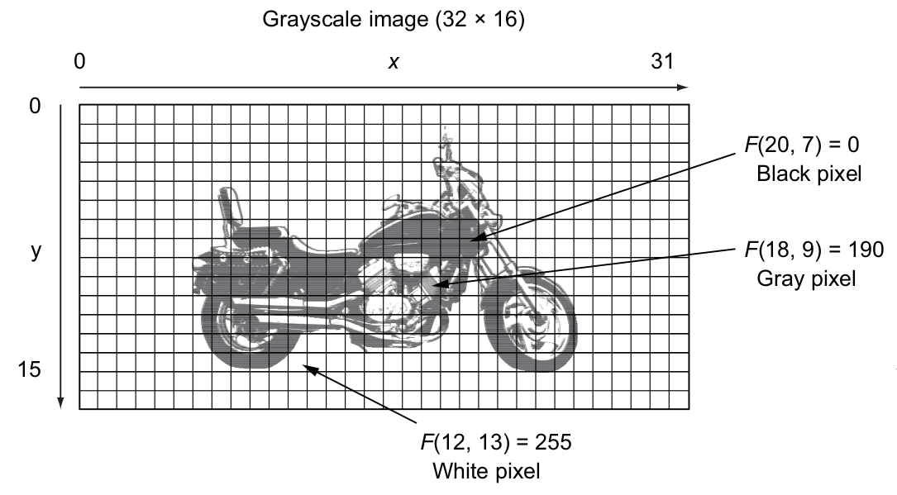]

.footnote[Credits: Mohamed Elgendy. Deep Learning for Vision Systems, 2020.]

???
In CV applications, we deal with images or video data. Let’s talk about grayscale and color images for now, and in later slides, we will talk about videos, since videos are just stacked sequential frames of images.

Image as functions. An image can be represented as a function of two variables *x* and *y*, which define a two-dimensional area. A digital image is made of a grid of pixels. The *pixel* is the raw building block of an image. Every image consists of a set of pixels in which their values represent the *intensity* of light that appears in a given place in the image. Let’s take a look at the motorcycle example again after applying the pixel grid to it.

Our image has a size of 32 × 16. This means the dimensions of the image are 32 pixels wide and 16 pixels tall. The *x*-axis goes from 0 to 31, and the *y*-axis from 0 to 16. Overall, the image has 512 (32 × 16) pixels. In this grayscale image, each pixel contains a value that represents the intensity of light on that specific pixel. The pixel values range from 0 to 255. Since the pixel value represents the intensity of light, the value 0 represents very dark pixels (black), 255 is very bright (white), and the values in between represent the intensity on the grayscale.

Thinking of an image as a function is very useful in image processing. We can think of an image as a function of $F(x, y)$ and operate on it mathematically to transform it to a new image function $G(x, y)$.

---

class: middle

# How do computers see images?
## Example 1

.grid.center[
.kol-1-2.center[.width-100[]]
.kol-1-2[.width-100[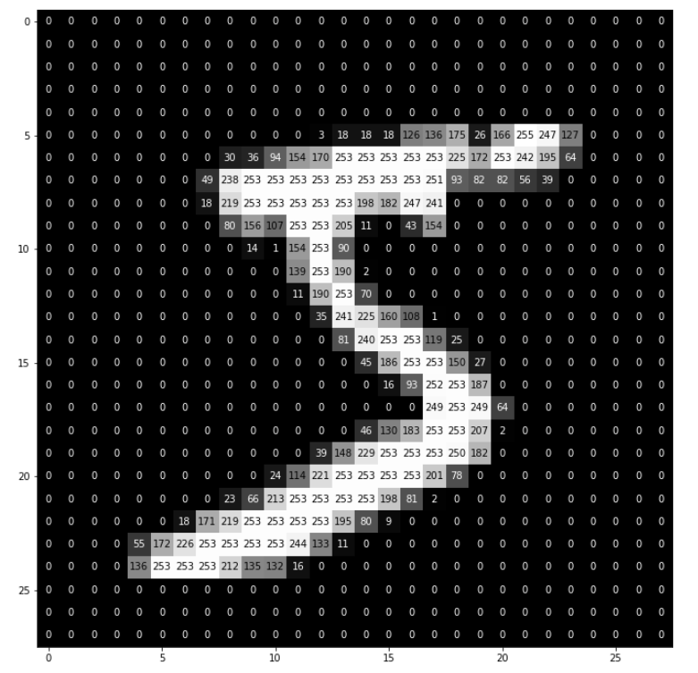]]
]

.grid[
.center.kol-1-2[What we see]
.center.kol-1-2[What computers see]]

.footnote[Credits: Mohamed Elgendy. Deep Learning for Vision Systems, 2020.]

???
When we look at an image, we see objects, landscape, colors, and so on. But that’s not the case with computers. Let's consider the figure on this slide. Your brain can process it and immediately know that it is a picture of a handwritten digit. To a computer, the image looks like a 2D matrix of the pixels’ values, which represent intensities across the color spectrum. There is no context here, just a massive pile of data.

---

class: middle

# How do computers see images?
## Example 2

.center.width-100[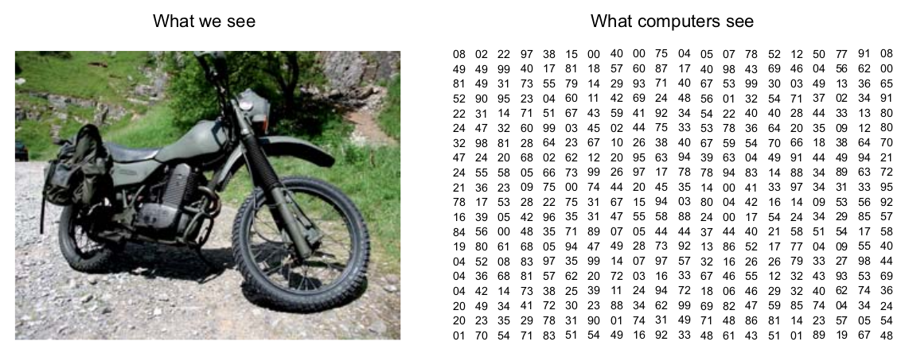]

.footnote[Credits: Mohamed Elgendy. Deep Learning for Vision Systems, 2020.]

???
A computer sees images as matrices of values. The values represent the intensity of the pixels across the color spectrum. For example, grayscale images range between pixel values of 0 for black and 255 for white. This image is of size 24 × 24. This size indicates the width and height of the image: there are 24 pixels horizontally and 24 vertically. That means there is a total of 576 (24 × 24) pixels.

---

class: middle

# Color images

.center.width-100[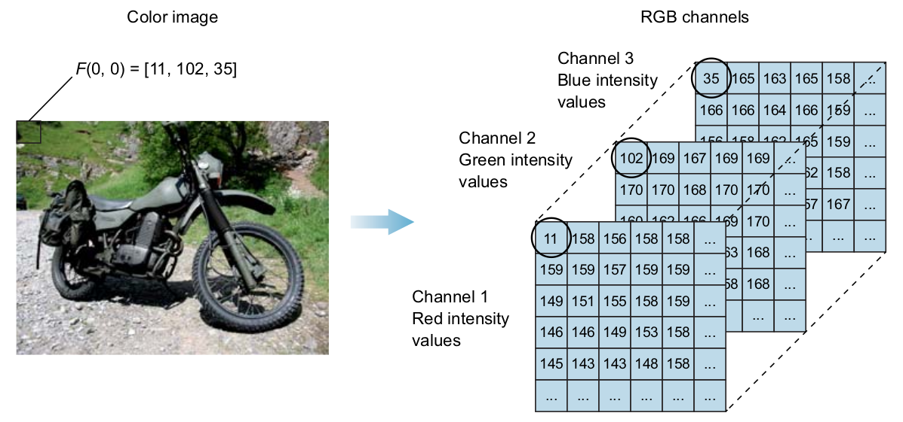]

.width-50[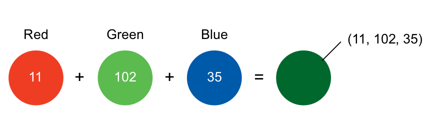]

.footnote[Credits: Mohamed Elgendy. Deep Learning for Vision Systems, 2020.]

???
In grayscale images, each pixel represents the intensity of only one color, whereas in the standard RGB system, color images have three channels (red, green, and
blue). In other words, color images are represented by three matrices: one represents the intensity of red in the pixel, one represents green, and one represents blue. As you can see in this figure, the color image is composed of three channels: red, green, and blue. Now the question is, how do computers see this image? In this case, we will have three matrices stacked on top of each other; that’s why it’s a 3D matrix. Let’s say the first matrix represents the red channel; then each element of that matrix represents an intensity of red color in that pixel, and likewise with green and blue. Each pixel in a color image has three numbers (0 to 255) associated with it. These numbers represent intensity of red, green, and blue color in that particular pixel. 

If we take the pixel (0,0) as an example, we will see that it represents the top-left pixel of the image of green grass.

---

class: middle

# Summary

.center.width-100[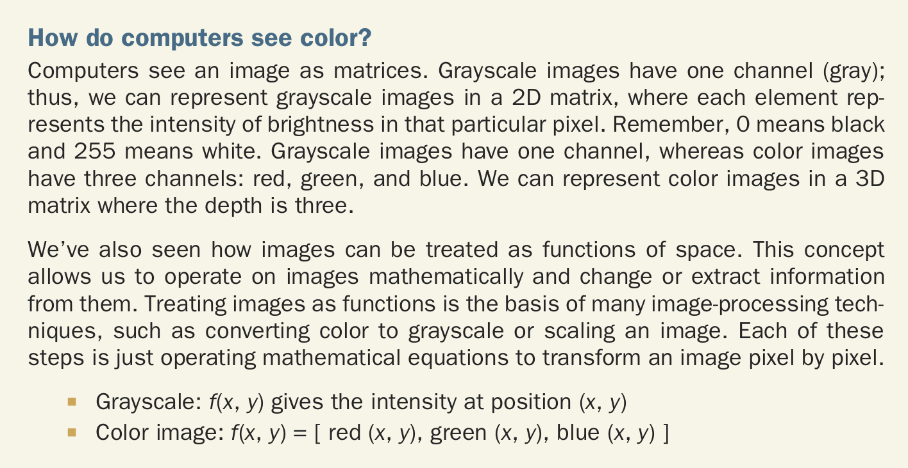]

.footnote[Credits: Mohamed Elgendy. Deep Learning for Vision Systems, 2020.]

???
Computers see an image as matrices. Grayscale images have one channel (gray); thus, we can represent grayscale images in a 2D matrix, where each element represents the intensity of brightness in that particular pixel. Remember, 0 means black and 255 means white. Grayscale images have one channel, whereas color images have three channels: red, green, and blue. We can represent color images in a 3D matrix where the depth is three.

---

class: blue-slide, middle, center
count: false

.larger-xx[Preprocessing]

---

class: middle

## Image preprocessing: Converting color images to grayscale

.center.width-100[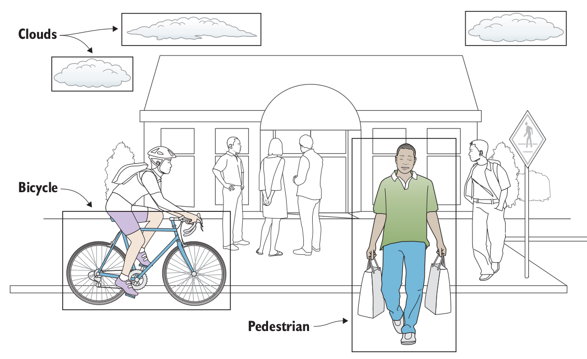]

.footnote[Credits: Mohamed Elgendy. Deep Learning for Vision Systems, 2020.]

???
In machine learning (ML) projects, you usually go through a data preprocessing or cleaning step. As an ML engineer, you will spend a good amount of time cleaning up and preparing the data before you build your learning model. The goal of this step is to make your data ready for the ML model to make it easier to analyze and process computationally. The same thing is true with images. Based on the problem you are solving and the dataset in hand, some data massaging is required before you feed your images to the ML model.

Image processing could involve simple tasks like image resizing. Later, you will learn that in order to feed a dataset of images to a convolutional network, the images all have to be the same size. Other processing tasks can take place, like geometric and color transformation, converting color to grayscale, and many more.

The acquired data is usually messy and comes from different sources. To feed it to the ML model (or neural network), it needs to be standardized and cleaned up. Preprocessing is used to conduct steps that will reduce the complexity and increase the accuracy of the applied algorithm. We can’t write a unique algorithm for each of the conditions in which an image is taken; thus, when we acquire an image, we convert it into a form that would allow a general algorithm to solve it. 

Converting color images to grayscale to reduce computation complexity. Sometimes you will find it useful to remove unnecessary information from your images to reduce space or computational complexity. For example, suppose you want to convert your colored images to grayscale, because for many objects, color is not necessary to recognize and interpret an image. Grayscale can be good enough for recognizing certain objects. Since color images contain more information than black-and-white images, they can add unnecessary complexity and take up more space in memory.

---

class: middle

.center.width-90[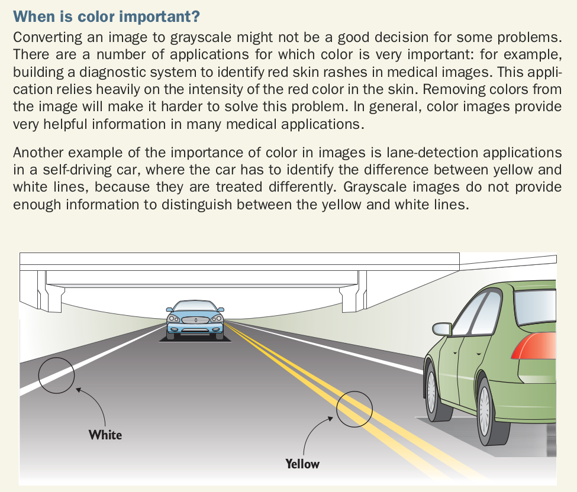]

.footnote[Credits: Mohamed Elgendy. Deep Learning for Vision Systems, 2020.]

???
Converting an image to grayscale might not be a good decision for some problems. There are a number of applications for which color is very important: for example, building a diagnostic system to identify red skin rashes in medical images. This application relies heavily on the intensity of the red color in the skin. Removing colors from the image will make it harder to solve this problem. In general, color images provide very helpful information in many medical applications.

Another example of the importance of color in images is lane-detection applications in a self-driving car, where the car has to identify the difference between yellow and white lines, because they are treated differently. Grayscale images do not provide enough information to distinguish between the yellow and white lines.

---

class: middle

## Image preprocessing: Standardizing images

.success[One important constraint that exists in some ML algorithms, such as CNNs, is the need to resize the images in your dataset to unified dimensions. This implies that your images must be preprocessed and scaled to have identical widths and heights before being fed to the learning algorithm.]

.footnote[Credits: Mohamed Elgendy. Deep Learning for Vision Systems, 2020.]

---

class: middle

## Image preprocessing: Data augmentation

.center.width-80[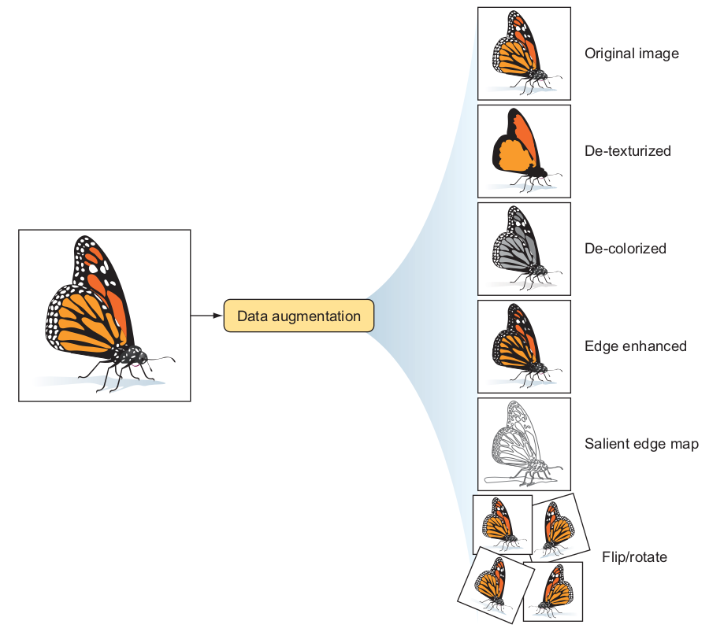]

.footnote[Credits: Mohamed Elgendy. Deep Learning for Vision Systems, 2020.]

???
Another common preprocessing technique involves augmenting the existing dataset with modified versions of the existing images. Scaling, rotations, and other affine transformations are typically used to enlarge your dataset and expose the neural network to a wide variety of variations of your images. This makes it more likely that your model will recognize objects when they appear in any form and shape.

---

class: blue-slide, middle, center
count: false

.larger-xx[Feature extraction]

???
*Feature extraction* is a core component of the CV pipeline. In fact, the entire DL model works around the idea of extracting useful features that clearly define the objects in the image. So we’ll spend a little more time here, because it is important that you understand what a feature is, what a vector of features is, and why we extract features.

---

class: middle

.alert.smaller-x[*Definition.* A feature in machine learning is an individual measurable property or characteristic of an observed phenomenon. Features are the input that you feed to your ML model to output a prediction or classification. 

Suppose you want to predict the price of a house: your input features (properties) might include *square_foot*, *number_of_rooms*, *bathrooms*, and so on, and
the model will output the predicted price based on the values of your features. Selecting good features that clearly distinguish your objects increases
the predictive power of ML algorithms.]

.footnote[Credits: Mohamed Elgendy. Deep Learning for Vision Systems, 2020.]

---

class: middle

## What is a feature in computer vision?

.center.width-80[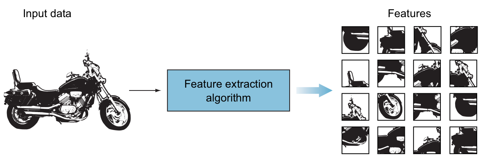]

.smaller-x[Example input image fed to a feature-extraction algorithm to find patterns within the image and create the feature vector]

.footnote[Credits: Mohamed Elgendy. Deep Learning for Vision Systems, 2020.]

???
In CV, a feature is a measurable piece of data in your image that is unique to that specific object. It may be a distinct color or a specific shape such as a line, edge, or image segment. A good feature is used to distinguish objects from one another. For example, if I give you a feature like a wheel and ask you to guess whether an object is a motorcycle or a dog, what would your guess be? A motorcycle. Correct! In this case, the wheel is a strong feature that clearly distinguishes between motorcycles and dogs. However, if I give you the same feature (a wheel) and ask you to guess whether an object is a bicycle or a motorcycle, this feature is not strong enough to distinguish between those objects. You need to look for more features like a mirror, license plate, or maybe a
pedal, that collectively describe an object. In ML projects, we want to transform the raw data (image) into a feature vector to show to our learning algorithm, which can learn the characteristics of the object.

In the figure, we feed the raw input image of a motorcycle into a feature extraction algorithm. For now, we need to know that the extraction algorithm produces
a vector that contains a list of features. This feature vector is a 1D array that makes a robust representation of the object.

---

class: middle

## Feature generalizability

.center.width-90[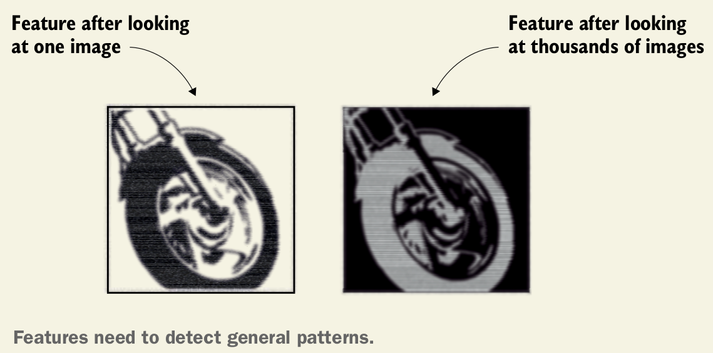]

.footnote[Credits: Mohamed Elgendy. Deep Learning for Vision Systems, 2020.]

???
It is important to point out that previous figure reflects features extracted from just one motorcycle. A very important characteristic of a feature is repeatability. The feature should be able to detect motorcycles in general, not just this specific one. So in real-
world problems, a feature is not an exact copy of a piece of the input image.

Machine learning models are only as good as the features you provide. That means coming up with good features is an important job in building ML models.

---

class: middle

## Extracting features: handcrafted

.center.width-90[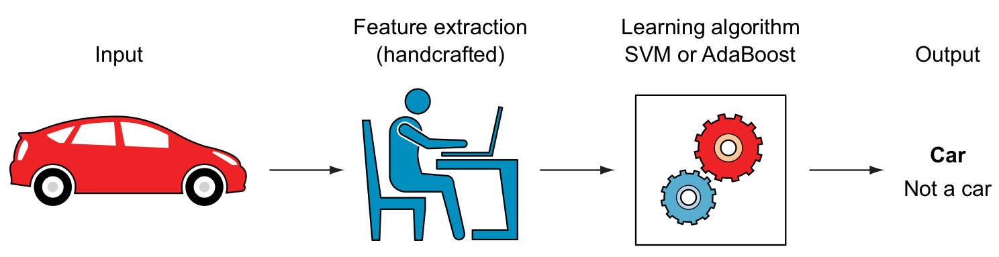]

.smaller-x[Traditional machine learning algorithms require handcrafted feature extraction]

.footnote[Credits: Mohamed Elgendy. Deep Learning for Vision Systems, 2020.]

???
In traditional ML problems, we spend a good amount of time in manual feature selection and engineering. In this process, we rely on our domain knowledge (or partner with domain experts) to create features that make ML algorithms work better. We then feed the produced features to a classifier like a support vector machine (SVM) or AdaBoost to predict the output.

---

class: middle

## Extracting features: automatic extracting

.center.width-90[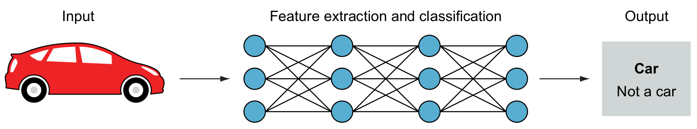]

.smaller-x[A deep neural network passes the input image through its layers to automatically extract features and classify the object. No handcrafted features are needed]

.footnote[Credits: Mohamed Elgendy. Deep Learning for Vision Systems, 2020.]

???
In DL, however, we do not need to manually extract features from the image. The network extracts features automatically and learns their importance on the output by applying weights to its connections. You just feed the raw image to the network, and while it passes through the network layers, the network identifies patterns within the image with which to create features. Neural networks can be thought of as feature extractors plus classifiers that are end-to-end trainable, as opposed to traditional ML models that use handcrafted features.

---

class: middle

## Extracting features: automatic extracting

.center.width-90[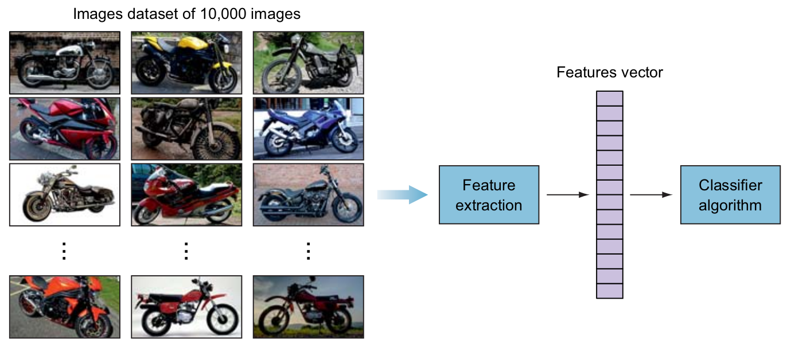]

.smaller-x[Extracting and consolidating features from thousands of images in one feature vector to be fed to the classifier]

.footnote[Credits: Mohamed Elgendy. Deep Learning for Vision Systems, 2020.]

???
The input image has too much extra information that is not necessary for classification. Therefore, the first step after preprocessing the image is to simplify it by extracting the important information and throwing away nonessential information. By extracting important colors or image segments, we can transform complex and large image data into smaller sets of features. This makes the task of classifying images based on their features simpler and faster. 

Consider the following example. Suppose we have a dataset of 10,000 images of motorcycles, each of 1,000 width by 1,000 height. Some images have solid backgrounds, and others have busy backgrounds of unnecessary data. When these thousands of images are fed to the feature extraction algorithms, we lose all the unnecessary data that is not important to identify motorcycles, and we only keep a consolidated list of useful features that can be fed directly to the classifier.

---

class: middle, center

# Demo

.larger-x[[Image Preprocessing](https://github.com/YKochura/cv-kpi/blob/main/homeworks/lab2-3/Logistic_regression_solution.ipynb)]

---

class: end-slide, center
count: false

.larger-xx[The end]

